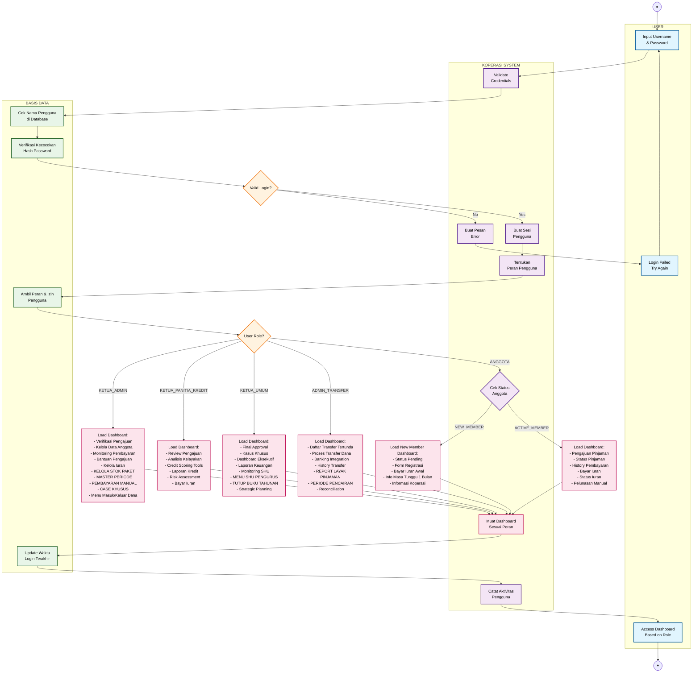

# Activity Diagram - Authentication & Role-Based Access

```mermaid
flowchart TD
    %% Initial Node
    Start([●]) --> InputCredentials
    
    %% User Swimlane
    subgraph UserLane [" USER "]
        direction TB
        InputCredentials[Input Username<br/>& Password]
        LoginFailed[Login Failed<br/>Try Again]
        AccessDashboard[Access Dashboard<br/>Based on Role]
    end
    
    %% System Swimlane  
    subgraph SystemLane [" KOPERASI SYSTEM "]
        direction TB
        ValidateCredentials[Validate<br/>Credentials]
        CreateSession[Buat Sesi<br/>Pengguna]
        DetermineRole[Tentukan<br/>Peran Pengguna]
        LoadDashboard[Muat Dashboard<br/>Sesuai Peran]
        LogActivity[Catat Aktivitas<br/>Pengguna]
        CheckMemberStatus{Cek Status<br/>Anggota}
        ErrorHandling[Buat Pesan<br/>Error]
    end
    
    %% Database Swimlane
    subgraph DatabaseLane [" BASIS DATA "]
        direction TB
        CheckUser[Cek Nama Pengguna<br/>di Database]
        VerifyPassword[Verifikasi Kecocokan<br/>Hash Password]
        GetUserRole[Ambil Peran & Izin<br/>Pengguna]
        UpdateLastLogin[Update Waktu<br/>Login Terakhir]
    end
    
    %% Decision Points
    LoginValid{Valid Login?}
    RoleDecision{User Role?}
    
    %% Flow connections
    InputCredentials --> ValidateCredentials
    ValidateCredentials --> CheckUser
    CheckUser --> VerifyPassword
    VerifyPassword --> LoginValid
    
    LoginValid -->|No| ErrorHandling
    ErrorHandling --> LoginFailed
    LoginFailed --> InputCredentials
    
    LoginValid -->|Yes| CreateSession
    CreateSession --> DetermineRole
    DetermineRole --> GetUserRole
    GetUserRole --> RoleDecision
    
    %% Role-based Dashboard Loading
    RoleDecision -->|ANGGOTA| CheckMemberStatus
    
    CheckMemberStatus -->|NEW_MEMBER| LoadNewMemberDashboard[Load New Member Dashboard:<br/>- Status Pending<br/>- Form Registrasi<br/>- Bayar Iuran Awal<br/>- Info Masa Tunggu 1 Bulan<br/>- Informasi Koperasi]
    
    CheckMemberStatus -->|ACTIVE_MEMBER| LoadAnggotaDashboard[Load Dashboard:<br/>- Pengajuan Pinjaman<br/>- Status Pinjaman<br/>- History Pembayaran<br/>- Bayar Iuran<br/>- Status Iuran<br/>- Pelunasan Manual]
    
    RoleDecision -->|KETUA_ADMIN| LoadAdminDashboard[Load Dashboard:<br/>- Verifikasi Pengajuan<br/>- Kelola Data Anggota<br/>- Monitoring Pembayaran<br/>- Bantuan Pengajuan<br/>- Kelola Iuran<br/>- KELOLA STOK PAKET<br/>- MASTER PERIODE<br/>- PEMBAYARAN MANUAL<br/>- CASE KHUSUS<br/>- Menu Masuk/Keluar Dana]
    
    RoleDecision -->|KETUA_PANITIA_KREDIT| LoadPanitiaDashboard[Load Dashboard:<br/>- Review Pengajuan<br/>- Analisis Kelayakan<br/>- Credit Scoring Tools<br/>- Laporan Kredit<br/>- Risk Assessment<br/>- Bayar Iuran]
    
    RoleDecision -->|KETUA_UMUM| LoadKetuaDashboard[Load Dashboard:<br/>- Final Approval<br/>- Kasus Khusus<br/>- Dashboard Eksekutif<br/>- Laporan Keuangan<br/>- Monitoring SHU<br/>- MENU SHU PENGURUS<br/>- TUTUP BUKU TAHUNAN<br/>- Strategic Planning]
    
    RoleDecision -->|ADMIN_TRANSFER| LoadTransferDashboard[Load Dashboard:<br/>- Daftar Transfer Tertunda<br/>- Proses Transfer Dana<br/>- Banking Integration<br/>- History Transfer<br/>- REPORT LAYAK PINJAMAN<br/>- PERIODE PENCAIRAN<br/>- Reconciliation]
    
    LoadAnggotaDashboard --> LoadDashboard
    LoadNewMemberDashboard --> LoadDashboard
    LoadAdminDashboard --> LoadDashboard
    LoadPanitiaDashboard --> LoadDashboard
    LoadKetuaDashboard --> LoadDashboard
    LoadTransferDashboard --> LoadDashboard
    
    LoadDashboard --> UpdateLastLogin
    UpdateLastLogin --> LogActivity
    LogActivity --> AccessDashboard
    AccessDashboard --> End([●])
    
    %% Styling for swimlanes
    classDef userStyle fill:#e1f5fe,stroke:#01579b,stroke-width:2px,color:#000
    classDef systemStyle fill:#f3e5f5,stroke:#4a148c,stroke-width:2px,color:#000
    classDef databaseStyle fill:#e8f5e8,stroke:#1b5e20,stroke-width:2px,color:#000
    classDef decisionStyle fill:#fff3e0,stroke:#ef6c00,stroke-width:2px,color:#000
    classDef dashboardStyle fill:#fce4ec,stroke:#c2185b,stroke-width:2px,color:#000
    
    class InputCredentials,LoginFailed,AccessDashboard userStyle
    class ValidateCredentials,CreateSession,DetermineRole,LogActivity,ErrorHandling,CheckMemberStatus systemStyle
    class CheckUser,VerifyPassword,GetUserRole,UpdateLastLogin databaseStyle
    class LoginValid,RoleDecision decisionStyle
    class LoadNewMemberDashboard,LoadAnggotaDashboard,LoadAdminDashboard,LoadPanitiaDashboard,LoadKetuaDashboard,LoadTransferDashboard,LoadDashboard dashboardStyle
```
