# Activity Diagram - Loan Application (Pengajuan Pinjaman)

```mermaid
flowchart TD
    %% Initial Node
    Start([●]) --> CheckPeriod
    
    %% Member Swimlane
    subgraph MemberLane [" ANGGOTA "]
        direction TB
        SelectLoanApp[Select<br/>Loan Application]
        FillForm[Fill Application<br/>Form]
        SelectPackage[Select Package<br/>& Tenor]
        InputPurpose[Input Loan<br/>Purpose]
        ReviewSimulation[Review Loan<br/>Simulation]
        ConfirmApplication[Confirm<br/>Application]
        ApplicationSubmitted[Application<br/>Submitted]
        StockNotAvailable[Stock Not<br/>Available]
        PeriodClosed[Period Closed<br/>Notification]
    end
    
    %% System Swimlane
    subgraph SystemLane [" LOAN SYSTEM "]
        direction TB
        CheckPeriod{Period Still<br/>Open?}
        CheckEligibility[Check Member<br/>Eligibility]
        ValidateStock[Validate Package<br/>Stock Available]
        LoadFormOptions[Load Form<br/>Options]
        ValidateInput[Validate<br/>Input Data]
        CalculateLoan[Calculate Loan<br/>Amount]
        CalculateInterest[Calculate Monthly<br/>Interest 1%]
        CalculatePrincipal[Calculate Monthly<br/>Principal]
        CalculateInstallment[Calculate Varied<br/>Monthly Installment]
        GenerateSimulation[Generate Payment<br/>Simulation]
        ProcessApplication[Process<br/>Application]
        ReservePackage[Reserve Package<br/>Temporarily]
        QueueApproval[Antre untuk<br/>Persetujuan]
        NotifySubmission[Notifikasi Pengajuan<br/>Terkirim]
        GenerateNotification[Buat Notifikasi<br/>Stok]
        AutoApproveTopUp[Setujui Otomatis<br/>Kelayakan Top-up]
        NewLoanProcess[Proses sebagai<br/>Pinjaman Baru]
    end
    
    %% Database Swimlane
    subgraph DatabaseLane [" BASIS DATA "]
        direction TB
        QueryActiveLoan[Query Status<br/>Pinjaman Aktif]
        CheckRemainingPayments[Cek Sisa Pembayaran<br/>≤ 2 Bulan]
        QueryPackageStock[Query Ketersediaan<br/>Stok Paket]
        CreateApplication[Buat Record<br/>Pengajuan]
        UpdateStock[Update Stock<br/>Status: RESERVED]
        LogSubmission[Log Application<br/>Submission]
    end
    
    %% Decision Points
    EligibilityDecision{Remaining ≤ 2 months?}
    StockDecision{Stock Available?}
    
    %% Flow connections
    Start --> CheckPeriod
    CheckPeriod -->|No| PeriodClosed
    PeriodClosed --> EndPeriodClosed([●])
    CheckPeriod -->|Yes| SelectLoanApp
    
    SelectLoanApp --> CheckEligibility
    CheckEligibility --> QueryActiveLoan
    QueryActiveLoan --> CheckRemainingPayments
    CheckRemainingPayments --> EligibilityDecision
    
    EligibilityDecision -->|Yes| AutoApproveTopUp
    EligibilityDecision -->|No| NewLoanProcess
    
    AutoApproveTopUp --> ValidateStock
    NewLoanProcess --> ValidateStock
    
    ValidateStock --> QueryPackageStock
    QueryPackageStock --> StockDecision
    
    StockDecision -->|No| GenerateNotification
    GenerateNotification --> StockNotAvailable
    StockNotAvailable --> EndUnavailable([●])
    
    StockDecision -->|Yes| LoadFormOptions
    LoadFormOptions --> FillForm
    FillForm --> SelectPackage
    SelectPackage --> InputPurpose
    InputPurpose --> ValidateInput
    
    ValidateInput --> CalculateLoan
    CalculateLoan --> CalculateInterest
    CalculateInterest --> CalculatePrincipal
    CalculatePrincipal --> CalculateInstallment
    CalculateInstallment --> GenerateSimulation
    GenerateSimulation --> ReviewSimulation
    
    ReviewSimulation --> ConfirmApplication
    ConfirmApplication --> ProcessApplication
    ProcessApplication --> CreateApplication
    CreateApplication --> ReservePackage
    ReservePackage --> UpdateStock
    UpdateStock --> QueueApproval
    QueueApproval --> LogSubmission
    LogSubmission --> NotifySubmission
    NotifySubmission --> ApplicationSubmitted
    ApplicationSubmitted --> End([●])
    
    %% Styling for swimlanes
    classDef memberStyle fill:#e1f5fe,stroke:#01579b,stroke-width:2px,color:#000
    classDef systemStyle fill:#f3e5f5,stroke:#4a148c,stroke-width:2px,color:#000
    classDef databaseStyle fill:#e8f5e8,stroke:#1b5e20,stroke-width:2px,color:#000
    classDef decisionStyle fill:#fff3e0,stroke:#ef6c00,stroke-width:2px,color:#000
    
    class SelectLoanApp,FillForm,SelectPackage,InputPurpose,ReviewSimulation,ConfirmApplication,ApplicationSubmitted,StockNotAvailable,PeriodClosed memberStyle
    class CheckPeriod,CheckEligibility,ValidateStock,LoadFormOptions,ValidateInput,CalculateLoan,CalculateInterest,CalculatePrincipal,CalculateInstallment,GenerateSimulation,ProcessApplication,ReservePackage,QueueApproval,NotifySubmission,GenerateNotification,AutoApproveTopUp,NewLoanProcess systemStyle
    class QueryActiveLoan,CheckRemainingPayments,QueryPackageStock,CreateApplication,UpdateStock,LogSubmission databaseStyle
    class EligibilityDecision,StockDecision decisionStyle
```

## Penjelasan Diagram

Diagram ini menunjukkan alur pengajuan pinjaman dengan pembagian swimlanes yang jelas:

### 👥 ANGGOTA (Member Lane)
- Memilih pengajuan pinjaman
- Mengisi form aplikasi
- Memilih paket dan tenor
- Input tujuan pinjaman
- Review simulasi perhitungan
- Konfirmasi pengajuan

### 🤖 LOAN SYSTEM (System Lane)
- Validasi eligibility anggota
- Perhitungan otomatis pinjaman
- Generasi simulasi pembayaran
- Processing aplikasi
- Reservasi paket
- Notifikasi dashboard

### 🗄️ DATABASE (Database Lane)
- Query status pinjaman aktif
- Check stock availability
- Create application record
- Update stock status
- Log semua aktivitas

### Fitur Utama
- **Auto-Approval Top-up**: Sistem otomatis menyetujui top-up jika sisa cicilan ≤ 2 bulan
- **Stock Management**: Real-time check ketersediaan paket
- **Payment Calculation**: Bunga tetap 1% per bulan
- **Dashboard Notifications**: Semua notifikasi hanya melalui dashboard alerts
- **Application Tracking**: Full audit trail di database
