# Activity Diagram - Loan Approval Process (3-Level Approval)

```mermaid
flowchart TD
    %% Initial Node
    Start([●]) --> NotifyAdmin
    
    %% Admin Lane (Level 1)
    subgraph AdminLane [" KETUA ADMIN "]
        ReviewApplication[Review Application<br/>Documents]
        ApproveLevel1[Approve<br/>Level 1]
        RejectLevel1[Reject<br/>Level 1]
        AdminDecision{Admin<br/>Decision?}
    end
    
    %% Credit Committee Lane (Level 2)
    subgraph CreditLane [" PANITIA KREDIT "]
        CreditAnalysis[Perform Credit<br/>Analysis]
        RiskAssessment[Risk<br/>Assessment]
        ApproveLevel2[Approve<br/>Level 2]
        RejectLevel2[Reject<br/>Level 2]
        CreditDecision{Credit<br/>Decision?}
    end
    
    %% Executive Lane (Level 3)
    subgraph ExecutiveLane [" KETUA UMUM "]
        FinalReview[Final Executive<br/>Review]
        FinalApprove[Final<br/>Approval]
        FinalReject[Final<br/>Rejection]
        ExecutiveDecision{Executive<br/>Decision?}
    end
    
    %% System Lane
    subgraph SystemLane [" APPROVAL SYSTEM "]
        NotifyAdmin[Notify Admin<br/>for Review]
        LoadApplicationData[Load Application<br/>Data & History]
        LogAdminApproval[Log Admin<br/>Approval]
        LogAdminRejection[Log Admin<br/>Rejection]
        NotifyCreditCommittee[Notify Credit<br/>Committee]
        LogCreditApproval[Log Credit<br/>Approval]
        LogCreditRejection[Log Credit<br/>Rejection]
        NotifyExecutive[Notify<br/>Executive]
        LogFinalApproval[Log Final<br/>Approval]
        LogFinalRejection[Log Final<br/>Rejection]
        ReleaseStock[Release Reserved<br/>Stock]
        GenerateRejectionNotice[Generate Rejection<br/>Dashboard Alert]
        ProcessForTransfer[Process for<br/>Fund Transfer]
    end
    
    %% Database Lane
    subgraph DatabaseLane [" DATABASE "]
        QueryApplicationDetails[Query Application<br/>Details]
        UpdateStatusL1Approved[Update Status:<br/>L1_APPROVED]
        UpdateStatusL1Rejected[Update Status:<br/>L1_REJECTED]
        UpdateStatusL2Approved[Update Status:<br/>L2_APPROVED]
        UpdateStatusL2Rejected[Update Status:<br/>L2_REJECTED]
        UpdateStatusFinalApproved[Update Status:<br/>FINAL_APPROVED]
        UpdateStatusFinalRejected[Update Status:<br/>FINAL_REJECTED]
        UpdateStockAvailable[Update Stock:<br/>AVAILABLE]
        LogApprovalHistory[Log Approval<br/>History]
    end
    
    %% Member Lane
    subgraph MemberLane [" ANGGOTA "]
        ReceiveRejectionL1[Application Rejected<br/>by Admin]
        ReceiveRejectionL2[Application Rejected<br/>by Credit Committee]
        ReceiveRejectionFinal[Application Rejected<br/>by Executive]
        ApplicationApproved[Application<br/>Approved]
    end
    
    %% Flow connections
    Start --> NotifyAdmin
    NotifyAdmin --> LoadApplicationData
    LoadApplicationData --> QueryApplicationDetails
    QueryApplicationDetails --> ReviewApplication
    
    ReviewApplication --> AdminDecision
    AdminDecision -->|Approve| ApproveLevel1
    AdminDecision -->|Reject| RejectLevel1
    
    ApproveLevel1 --> LogAdminApproval
    LogAdminApproval --> UpdateStatusL1Approved
    UpdateStatusL1Approved --> NotifyCreditCommittee
    
    RejectLevel1 --> LogAdminRejection
    LogAdminRejection --> UpdateStatusL1Rejected
    UpdateStatusL1Rejected --> ReleaseStock
    ReleaseStock --> UpdateStockAvailable
    UpdateStockAvailable --> GenerateRejectionNotice
    GenerateRejectionNotice --> ReceiveRejectionL1
    ReceiveRejectionL1 --> EndRejectedL1([●])
    
    NotifyCreditCommittee --> CreditAnalysis
    CreditAnalysis --> RiskAssessment
    RiskAssessment --> CreditDecision
    
    CreditDecision -->|Approve| ApproveLevel2
    CreditDecision -->|Reject| RejectLevel2
    
    ApproveLevel2 --> LogCreditApproval
    LogCreditApproval --> UpdateStatusL2Approved
    UpdateStatusL2Approved --> NotifyExecutive
    
    RejectLevel2 --> LogCreditRejection
    LogCreditRejection --> UpdateStatusL2Rejected
    UpdateStatusL2Rejected --> ReleaseStock
    ReleaseStock --> UpdateStockAvailable
    UpdateStockAvailable --> GenerateRejectionNotice
    GenerateRejectionNotice --> ReceiveRejectionL2
    ReceiveRejectionL2 --> EndRejectedL2([●])
    
    NotifyExecutive --> FinalReview
    FinalReview --> ExecutiveDecision
    
    ExecutiveDecision -->|Approve| FinalApprove
    ExecutiveDecision -->|Reject| FinalReject
    
    FinalApprove --> LogFinalApproval
    LogFinalApproval --> UpdateStatusFinalApproved
    UpdateStatusFinalApproved --> LogApprovalHistory
    LogApprovalHistory --> ProcessForTransfer
    ProcessForTransfer --> ApplicationApproved
    ApplicationApproved --> End([●])
    
    FinalReject --> LogFinalRejection
    LogFinalRejection --> UpdateStatusFinalRejected
    UpdateStatusFinalRejected --> ReleaseStock
    ReleaseStock --> UpdateStockAvailable
    UpdateStockAvailable --> GenerateRejectionNotice
    GenerateRejectionNotice --> ReceiveRejectionFinal
    ReceiveRejectionFinal --> EndRejectedFinal([●])
    
    %% Styling for swimlanes
    classDef adminStyle fill:#e3f2fd,stroke:#0d47a1,stroke-width:2px
    classDef creditStyle fill:#f1f8e9,stroke:#33691e,stroke-width:2px
    classDef executiveStyle fill:#fce4ec,stroke:#880e4f,stroke-width:2px
    classDef systemStyle fill:#f3e5f5,stroke:#4a148c,stroke-width:2px
    classDef databaseStyle fill:#e8f5e8,stroke:#1b5e20,stroke-width:2px
    classDef memberStyle fill:#e1f5fe,stroke:#01579b,stroke-width:2px
    
    class ReviewApplication,ApproveLevel1,RejectLevel1,AdminDecision adminStyle
    class CreditAnalysis,RiskAssessment,ApproveLevel2,RejectLevel2,CreditDecision creditStyle
    class FinalReview,FinalApprove,FinalReject,ExecutiveDecision executiveStyle
    class NotifyAdmin,LoadApplicationData,LogAdminApproval,LogAdminRejection,NotifyCreditCommittee,LogCreditApproval,LogCreditRejection,NotifyExecutive,LogFinalApproval,LogFinalRejection,ReleaseStock,GenerateRejectionNotice,ProcessForTransfer systemStyle
    class QueryApplicationDetails,UpdateStatusL1Approved,UpdateStatusL1Rejected,UpdateStatusL2Approved,UpdateStatusL2Rejected,UpdateStatusFinalApproved,UpdateStatusFinalRejected,UpdateStockAvailable,LogApprovalHistory databaseStyle
    class ReceiveRejectionL1,ReceiveRejectionL2,ReceiveRejectionFinal,ApplicationApproved memberStyle
```

## Penjelasan 3-Level Approval Process

Diagram ini menunjukkan proses persetujuan pinjaman dengan 3 tingkat approval:

### 👥 KETUA ADMIN (Level 1)
- Review dokumen pengajuan
- Verifikasi kelengkapan data
- Keputusan approve/reject level 1

### 🏛️ PANITIA KREDIT (Level 2)  
- Analisis kelayakan kredit
- Risk assessment
- Keputusan approve/reject level 2

### 👔 KETUA UMUM (Level 3)
- Final executive review
- Keputusan akhir approve/reject
- Authority untuk approval final

### 🤖 APPROVAL SYSTEM (System Lane)
- Automated workflow management
- Notification system
- Status tracking dan logging
- Dashboard alerts only

### 🗄️ DATABASE (Database Lane)
- Update status aplikasi
- Logging approval history
- Stock management
- Audit trail lengkap

### 👤 ANGGOTA (Member Lane)
- Menerima notifikasi hasil
- Dashboard alerts untuk status
- Informasi rejection/approval

### Fitur Utama
- **3-Level Approval**: Admin → Credit Committee → Executive
- **Stock Management**: Auto-release jika ditolak di level manapun
- **Audit Trail**: Complete logging di setiap tahap
- **Dashboard Notifications**: Semua notifikasi via dashboard alerts
- **Workflow Automation**: Sistem mengelola flow antar level
