# Activity Diagram - Fund Transfer Process

```mermaid
flowchart TD
    %% Initial Node
    Start([●]) --> CheckPendingTransfers
    
    %% Transfer Admin Lane
    subgraph TransferAdminLane [" ADMIN TRANSFER "]
        SelectTransfer[Select Transfer<br/>Application]
        VerifyDetails[Verify Transfer<br/>Details]
        ConfirmTransfer[Confirm<br/>Transfer]
        ExecuteTransfer[Execute Bank<br/>Transfer]
        UploadProof[Upload Transfer<br/>Proof]
        MarkCompleted[Mark Transfer<br/>Completed]
    end
    
    %% System Lane
    subgraph SystemLane [" TRANSFER SYSTEM "]
        CheckPendingTransfers[Check Pending<br/>Transfers]
        LoadTransferData[Load Transfer<br/>Application Data]
        ValidateTransferDetails[Validate Transfer<br/>Details]
        ProcessTransfer[Process<br/>Transfer]
        GenerateTransferRecord[Generate Transfer<br/>Record]
        UpdateTransferStatus[Update Transfer<br/>Status]
        NotifyTransferComplete[Notify Transfer<br/>Completion]
        StartPaymentCycle[Start Monthly<br/>Payment Cycle]
    end
    
    %% Database Lane
    subgraph DatabaseLane [" DATABASE "]
        QueryApprovedApplications[Query Final<br/>Approved Applications]
        QueryMemberBankDetails[Query Member<br/>Bank Details]
        CreateTransferRecord[Create Transfer<br/>Record]
        UpdateApplicationStatus[Update Status:<br/>TRANSFERRED]
        LogTransferActivity[Log Transfer<br/>Activity]
        UpdateLoanStatus[Update Loan<br/>Status: ACTIVE]
    end
    
    %% Member Lane
    subgraph MemberLane [" ANGGOTA "]
        ReceiveFunds[Receive<br/>Funds]
        ReceiveNotification[Receive Transfer<br/>Notification]
        StartRepayment[Start Monthly<br/>Repayment]
    end
    
    %% Banking System Lane
    subgraph BankingLane [" BANKING SYSTEM "]
        ProcessBankTransfer[Process Bank<br/>Transfer]
        GenerateTransferReceipt[Generate Transfer<br/>Receipt]
        ConfirmTransferSuccess[Confirm Transfer<br/>Success]
    end
    
    %% Flow connections
    Start --> CheckPendingTransfers
    CheckPendingTransfers --> QueryApprovedApplications
    QueryApprovedApplications --> SelectTransfer
    
    SelectTransfer --> LoadTransferData
    LoadTransferData --> QueryMemberBankDetails
    QueryMemberBankDetails --> VerifyDetails
    
    VerifyDetails --> ValidateTransferDetails
    ValidateTransferDetails --> ConfirmTransfer
    ConfirmTransfer --> ProcessTransfer
    
    ProcessTransfer --> ExecuteTransfer
    ExecuteTransfer --> ProcessBankTransfer
    ProcessBankTransfer --> GenerateTransferReceipt
    GenerateTransferReceipt --> ConfirmTransferSuccess
    
    ConfirmTransferSuccess --> UploadProof
    UploadProof --> GenerateTransferRecord
    GenerateTransferRecord --> CreateTransferRecord
    CreateTransferRecord --> MarkCompleted
    
    MarkCompleted --> UpdateTransferStatus
    UpdateTransferStatus --> UpdateApplicationStatus
    UpdateApplicationStatus --> LogTransferActivity
    LogTransferActivity --> UpdateLoanStatus
    
    UpdateLoanStatus --> NotifyTransferComplete
    NotifyTransferComplete --> ReceiveFunds
    ReceiveFunds --> ReceiveNotification
    
    ReceiveNotification --> StartPaymentCycle
    StartPaymentCycle --> StartRepayment
    StartRepayment --> End([●])
    
    %% Styling for swimlanes
    classDef adminStyle fill:#e3f2fd,stroke:#0d47a1,stroke-width:2px
    classDef systemStyle fill:#f3e5f5,stroke:#4a148c,stroke-width:2px  
    classDef databaseStyle fill:#e8f5e8,stroke:#1b5e20,stroke-width:2px
    classDef memberStyle fill:#e1f5fe,stroke:#01579b,stroke-width:2px
    classDef bankingStyle fill:#fff3e0,stroke:#e65100,stroke-width:2px
    
    class SelectTransfer,VerifyDetails,ConfirmTransfer,ExecuteTransfer,UploadProof,MarkCompleted adminStyle
    class CheckPendingTransfers,LoadTransferData,ValidateTransferDetails,ProcessTransfer,GenerateTransferRecord,UpdateTransferStatus,NotifyTransferComplete,StartPaymentCycle systemStyle
    class QueryApprovedApplications,QueryMemberBankDetails,CreateTransferRecord,UpdateApplicationStatus,LogTransferActivity,UpdateLoanStatus databaseStyle
    class ReceiveFunds,ReceiveNotification,StartRepayment memberStyle
    class ProcessBankTransfer,GenerateTransferReceipt,ConfirmTransferSuccess bankingStyle
```

## Penjelasan Fund Transfer Process

Diagram ini menunjukkan proses transfer dana setelah aplikasi pinjaman mendapat final approval:

### 👤 ADMIN TRANSFER
- Review daftar aplikasi yang sudah final approved
- Verifikasi detail transfer (nama, rekening, jumlah)
- Eksekusi transfer ke bank
- Upload bukti transfer
- Konfirmasi completion

### 🤖 TRANSFER SYSTEM (System Lane)
- Load aplikasi yang siap transfer
- Validasi detail transfer
- Process workflow transfer
- Generate transfer records
- Update status aplikasi
- Trigger payment cycle

### 🗄️ DATABASE (Database Lane)
- Query final approved applications
- Store transfer records
- Update application status
- Log semua aktivitas transfer
- Update loan status menjadi ACTIVE

### 👥 ANGGOTA (Member Lane)
- Menerima dana di rekening
- Mendapat dashboard notification
- Memulai siklus pembayaran bulanan

### 🏦 BANKING SYSTEM (Banking Lane)
- Process transfer antar bank
- Generate receipt/bukti transfer
- Confirm transfer success

### Fitur Utama
- **Transfer Verification**: Double-check detail sebelum eksekusi
- **Bank Integration**: Automated atau manual transfer
- **Proof Management**: Upload dan store bukti transfer
- **Status Tracking**: Real-time status update
- **Payment Activation**: Auto-trigger monthly payment cycle
- **Dashboard Notifications**: Semua notifikasi via dashboard alerts
