# Activity Diagram - Monthly Payment Cycle (Siklus Pembayaran)

```mermaid
flowchart TD
    %% Initial Node
    Start([●]) --> GenerateBills
    
    %% Member Lane
    subgraph MemberLane [" ANGGOTA "]
        ReceiveReminder[Receive Payment<br/>Reminder]
        PaymentDeducted[Payment Automatically<br/>Deducted from Salary]
        LoanCompleted[Loan<br/>Completed]
        ReceiveCertificate[Receive Completion<br/>Certificate]
    end
    
    %% System Lane
    subgraph SystemLane [" PAYMENT SYSTEM "]
        GenerateBills[Generate Monthly<br/>Bills]
        ScheduleReminders[Schedule Payment<br/>Reminders]
        SendReminders[Send Dashboard<br/>Reminders]
        IntegrateHR[Integrate with<br/>HR System]
        ProcessPayroll[Process Payroll<br/>Deduction]
        ConfirmDeduction[Confirm<br/>Deduction]
        SplitPayment[Split Payment<br/>Components]
        CreateJournalEntry[Create Journal<br/>Entry]
        UpdateBalances[Update Loan<br/>Balances]
        CheckCompletion[Check Loan<br/>Completion]
        ScheduleNextCycle[Schedule Next<br/>Cycle]
        FinalizeLoan[Finalize<br/>Loan]
        GenerateCertificate[Generate Completion<br/>Certificate]
        NotifyCompletion[Notify<br/>Completion]
    end
    
    %% Database Lane
    subgraph DatabaseLane [" DATABASE "]
        QueryActiveLoans[Query Active<br/>Loans]
        CreateBillRecords[Create Bill<br/>Records]
        UpdatePaymentStatus[Update Payment<br/>Status]
        RecordPaymentSplit[Record Payment<br/>Split]
        UpdatePrincipalBalance[Update Principal<br/>Balance]
        UpdatePaymentHistory[Update Payment<br/>History]
        UpdateLoanStatus[Update Loan<br/>Status]
        ArchiveLoanRecord[Archive Loan<br/>Record]
    end
    
    %% HR System Lane
    subgraph HRLane [" HR SYSTEM "]
        ReceiveDeductionRequest[Receive Deduction<br/>Request]
        ValidateSalary[Validate Salary<br/>Amount]
        ProcessSalaryDeduction[Process Salary<br/>Deduction]
        ConfirmDeductionSuccess[Confirm Deduction<br/>Success]
    end
    
    %% Accounting Lane
    subgraph AccountingLane [" ACCOUNTING "]
        ValidateJournalEntry[Validate Journal<br/>Entry]
        PostToLedger[Post to<br/>Ledger]
        UpdateAccountBalances[Update Account<br/>Balances]
    end
    
    %% Flow connections
    Start --> GenerateBills
    GenerateBills --> QueryActiveLoans
    QueryActiveLoans --> CreateBillRecords
    CreateBillRecords --> ScheduleReminders
    
    ScheduleReminders --> SendReminders
    SendReminders --> ReceiveReminder
    
    ReceiveReminder --> IntegrateHR
    IntegrateHR --> ProcessPayroll
    ProcessPayroll --> ReceiveDeductionRequest
    
    ReceiveDeductionRequest --> ValidateSalary
    ValidateSalary --> ProcessSalaryDeduction
    ProcessSalaryDeduction --> ConfirmDeductionSuccess
    
    ConfirmDeductionSuccess --> ConfirmDeduction
    ConfirmDeduction --> PaymentDeducted
    PaymentDeducted --> UpdatePaymentStatus
    
    UpdatePaymentStatus --> SplitPayment
    SplitPayment --> RecordPaymentSplit
    RecordPaymentSplit --> CreateJournalEntry
    
    CreateJournalEntry --> ValidateJournalEntry
    ValidateJournalEntry --> PostToLedger
    PostToLedger --> UpdateAccountBalances
    
    UpdateAccountBalances --> UpdateBalances
    UpdateBalances --> UpdatePrincipalBalance
    UpdatePrincipalBalance --> UpdatePaymentHistory
    UpdatePaymentHistory --> CheckCompletion
    
    CheckCompletion --> CompletionDecision{Loan<br/>Complete?}
    CompletionDecision -->|No| ScheduleNextCycle
    CompletionDecision -->|Yes| FinalizeLoan
    
    ScheduleNextCycle --> NextCycle([Next Month<br/>Cycle])
    NextCycle --> Start
    
    FinalizeLoan --> UpdateLoanStatus
    UpdateLoanStatus --> ArchiveLoanRecord
    ArchiveLoanRecord --> GenerateCertificate
    GenerateCertificate --> LoanCompleted
    
    LoanCompleted --> NotifyCompletion
    NotifyCompletion --> ReceiveCertificate
    ReceiveCertificate --> EndCompleted([●])
    
    %% Styling for swimlanes
    classDef memberStyle fill:#e1f5fe,stroke:#01579b,stroke-width:2px
    classDef systemStyle fill:#f3e5f5,stroke:#4a148c,stroke-width:2px  
    classDef databaseStyle fill:#e8f5e8,stroke:#1b5e20,stroke-width:2px
    classDef hrStyle fill:#fff3e0,stroke:#e65100,stroke-width:2px
    classDef accountingStyle fill:#f1f8e9,stroke:#33691e,stroke-width:2px
    
    class ReceiveReminder,PaymentDeducted,LoanCompleted,ReceiveCertificate memberStyle
    class GenerateBills,ScheduleReminders,SendReminders,IntegrateHR,ProcessPayroll,ConfirmDeduction,SplitPayment,CreateJournalEntry,UpdateBalances,CheckCompletion,ScheduleNextCycle,FinalizeLoan,GenerateCertificate,NotifyCompletion systemStyle
    class QueryActiveLoans,CreateBillRecords,UpdatePaymentStatus,RecordPaymentSplit,UpdatePrincipalBalance,UpdatePaymentHistory,UpdateLoanStatus,ArchiveLoanRecord databaseStyle
    class ReceiveDeductionRequest,ValidateSalary,ProcessSalaryDeduction,ConfirmDeductionSuccess hrStyle
    class ValidateJournalEntry,PostToLedger,UpdateAccountBalances accountingStyle
```

## Penjelasan Monthly Payment Cycle

Diagram ini menunjukkan siklus pembayaran bulanan otomatis:

### 👥 ANGGOTA (Member Lane)
- Menerima reminder pembayaran via dashboard
- Pembayaran otomatis dipotong dari gaji
- Notifikasi completion saat pinjaman lunas
- Menerima sertifikat pelunasan

### 🤖 PAYMENT SYSTEM (System Lane)
- Generate tagihan bulanan otomatis
- Schedule dan kirim reminder H-3
- Integrasi dengan sistem HR untuk potong gaji
- Split payment ke komponen pokok dan bunga
- Check completion status
- Generate sertifikat otomatis

### 🗄️ DATABASE (Database Lane)
- Query active loans untuk billing
- Update payment status dan history
- Track principal balance
- Archive completed loans
- Maintain audit trail lengkap

### 🏢 HR SYSTEM (HR Lane)
- Terima request deduction dari sistem
- Validate salary amount
- Process salary deduction
- Confirm deduction success

### 📊 ACCOUNTING (Accounting Lane)
- Validate journal entries
- Post ke general ledger
- Update account balances
- Maintain accounting integrity

### Fitur Utama
- **Automated Billing**: Generate tagihan otomatis setiap bulan
- **HR Integration**: Seamless integration dengan payroll system
- **Payment Split**: Otomatis split pokok dan bunga 1%
- **Dashboard Reminders**: H-3 reminder via dashboard alerts
- **Completion Tracking**: Otomatis detect loan completion
- **Certificate Generation**: Auto-generate completion certificate
- **Audit Trail**: Complete payment history dan journal entries
