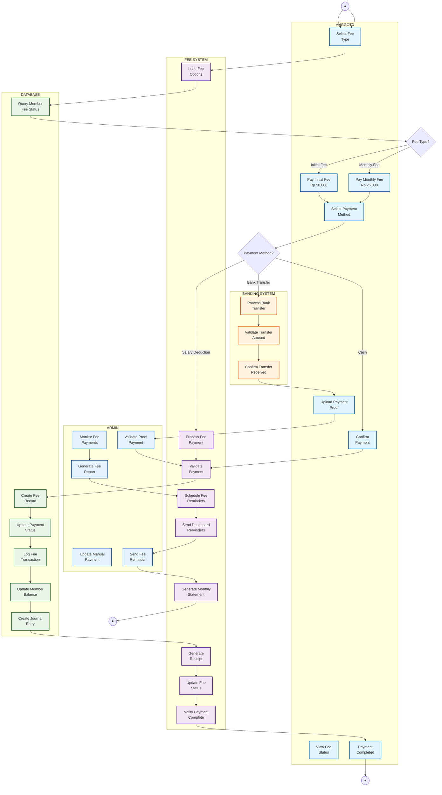

# Activity Diagram - Member Fee Management (Kelola Iuran Anggota)

## Penjelasan Member Fee Management

Diagram ini menunjukkan pengelolaan iuran anggota dengan berbagai metode pembayaran:

### 👥 ANGGOTA (Member Lane)
- Pilih jenis iuran (awal/bulanan)
- Pilih metode pembayaran
- Upload bukti pembayaran jika transfer
- View status pembayaran iuran

### 🤖 FEE SYSTEM (System Lane)
- Load opsi pembayaran iuran
- Process berbagai metode pembayaran
- Generate receipt otomatis
- Schedule reminder H-3 jatuh tempo
- Dashboard notifications

### 🗄️ DATABASE (Database Lane)
- Track status iuran per anggota
- Create fee records
- Update payment status
- Maintain complete audit trail
- Journal entry untuk accounting

### 👤 ADMIN (Admin Lane)
- Monitor pembayaran iuran semua anggota
- Validate proof of payment
- Update manual payment jika perlu
- Generate laporan iuran
- Send reminder ke anggota

### 🏦 BANKING SYSTEM (Banking Lane)
- Process transfer bank
- Validate transfer amount
- Confirm transfer received

### Fitur Utama
- **Multiple Payment Methods**: Transfer, cash, salary deduction
- **Automated Reminders**: Dashboard alerts H-3 jatuh tempo
- **Receipt Generation**: Auto-generate receipt setelah payment
- **Admin Monitoring**: Dashboard untuk monitor semua iuran
- **Audit Trail**: Complete logging semua transaksi iuran
- **Integration**: Terintegrasi dengan payroll untuk potong gaji
