# Activity Diagram - Package Stock Management (Kelola Stok Paket)

```mermaid
flowchart TD
    %% Initial Node
    Start([●]) --> AccessStockManagement
    
    %% Admin Lane
    subgraph AdminLane [" ADMIN "]
        AccessStockManagement[Access Stock<br/>Management]
        SetMonthlyStock[Set Monthly<br/>Stock Limit]
        MonitorStockUsage[Monitor Stock<br/>Usage]
        ReviewReservations[Review<br/>Reservations]
        ProcessMonthlyReset[Process Monthly<br/>Reset]
        GenerateStockReport[Generate Stock<br/>Report]
    end
    
    %% System Lane
    subgraph SystemLane [" STOCK SYSTEM "]
        LoadStockDashboard[Load Stock<br/>Dashboard]
        ValidateStockInput[Validate Stock<br/>Input]
        UpdateStockLimit[Update Stock<br/>Limit]
        CheckStockAvailability[Check Stock<br/>Availability]
        ReservePackage[Reserve<br/>Package]
        ReleaseReservation[Release<br/>Reservation]
        ConfirmPackageUsage[Confirm Package<br/>Usage]
        AutoMonthlyReset[Auto Monthly<br/>Reset]
        GenerateStockAlert[Generate Stock<br/>Alert]
        NotifyStockStatus[Notify Stock<br/>Status]
    end
    
    %% Database Lane
    subgraph DatabaseLane [" DATABASE "]
        QueryCurrentStock[Query Current<br/>Stock Status]
        UpdateStockSettings[Update Stock<br/>Settings]
        CreateStockRecord[Create Stock<br/>Record]
        UpdatePackageStatus[Update Package<br/>Status]
        LogStockActivity[Log Stock<br/>Activity]
        ResetMonthlyCounters[Reset Monthly<br/>Counters]
        UpdateReservationStatus[Update Reservation<br/>Status]
        ArchiveExpiredReservations[Archive Expired<br/>Reservations]
    end
    
    %% Application System Lane
    subgraph ApplicationLane [" APPLICATION SYSTEM "]
        RequestStockCheck[Request Stock<br/>Check]
        ReceiveStockStatus[Receive Stock<br/>Status]
        ProcessReservation[Process<br/>Reservation]
        HandleStockUnavailable[Handle Stock<br/>Unavailable]
        ConfirmFinalApproval[Confirm Final<br/>Approval]
        ReleaseOnRejection[Release on<br/>Rejection]
    end
    
    %% Flow connections - Stock Management
    Start --> AccessStockManagement
    AccessStockManagement --> LoadStockDashboard
    LoadStockDashboard --> QueryCurrentStock
    QueryCurrentStock --> SetMonthlyStock
    
    SetMonthlyStock --> ValidateStockInput
    ValidateStockInput --> UpdateStockLimit
    UpdateStockLimit --> UpdateStockSettings
    UpdateStockSettings --> MonitorStockUsage
    
    %% Flow connections - Stock Checking
    RequestStockCheck --> CheckStockAvailability
    CheckStockAvailability --> QueryCurrentStock
    QueryCurrentStock --> StockDecision{Stock Available?}
    
    StockDecision -->|No| GenerateStockAlert
    GenerateStockAlert --> HandleStockUnavailable
    HandleStockUnavailable --> NotifyStockUnavailable([Stock Unavailable])
    
    StockDecision -->|Yes| ReservePackage
    ReservePackage --> CreateStockRecord
    CreateStockRecord --> UpdatePackageStatus
    UpdatePackageStatus --> ProcessReservation
    ProcessReservation --> ReceiveStockStatus
    ReceiveStockStatus --> ReservationActive([Reservation Active])
    
    %% Flow connections - Approval Results
    ConfirmFinalApproval --> ConfirmPackageUsage
    ConfirmPackageUsage --> UpdatePackageStatus
    UpdatePackageStatus --> LogStockActivity
    LogStockActivity --> PackageConfirmed([Package Used])
    
    ReleaseOnRejection --> ReleaseReservation
    ReleaseReservation --> UpdateReservationStatus
    UpdateReservationStatus --> LogStockActivity
    LogStockActivity --> PackageReleased([Package Released])
    
    %% Flow connections - Monthly Reset
    MonitorStockUsage --> ReviewReservations
    ReviewReservations --> ProcessMonthlyReset
    ProcessMonthlyReset --> AutoMonthlyReset
    AutoMonthlyReset --> ResetMonthlyCounters
    ResetMonthlyCounters --> ArchiveExpiredReservations
    ArchiveExpiredReservations --> NotifyStockStatus
    NotifyStockStatus --> GenerateStockReport
    GenerateStockReport --> End([●])
    
    %% Styling for swimlanes
    classDef adminStyle fill:#e3f2fd,stroke:#0d47a1,stroke-width:2px
    classDef systemStyle fill:#f3e5f5,stroke:#4a148c,stroke-width:2px  
    classDef databaseStyle fill:#e8f5e8,stroke:#1b5e20,stroke-width:2px
    classDef applicationStyle fill:#f1f8e9,stroke:#33691e,stroke-width:2px
    
    class AccessStockManagement,SetMonthlyStock,MonitorStockUsage,ReviewReservations,ProcessMonthlyReset,GenerateStockReport adminStyle
    class LoadStockDashboard,ValidateStockInput,UpdateStockLimit,CheckStockAvailability,ReservePackage,ReleaseReservation,ConfirmPackageUsage,AutoMonthlyReset,GenerateStockAlert,NotifyStockStatus systemStyle
    class QueryCurrentStock,UpdateStockSettings,CreateStockRecord,UpdatePackageStatus,LogStockActivity,ResetMonthlyCounters,UpdateReservationStatus,ArchiveExpiredReservations databaseStyle
    class RequestStockCheck,ReceiveStockStatus,ProcessReservation,HandleStockUnavailable,ConfirmFinalApproval,ReleaseOnRejection applicationStyle
```

## Penjelasan Package Stock Management

Diagram ini menunjukkan pengelolaan stok paket pinjaman dengan sistem reservasi:

### 👤 ADMIN (Admin Lane)
- Set limit stok paket per bulan
- Monitor penggunaan stok real-time
- Review reservasi aktif
- Process monthly reset
- Generate laporan stok

### 🤖 STOCK SYSTEM (System Lane)
- Real-time stock availability check
- Automated reservation system
- Package status management
- Monthly reset automation
- Stock alert generation
- Dashboard notifications

### 🗄️ DATABASE (Database Lane)
- Store stock settings dan limits
- Track package status (Available/Reserved/Used)
- Log semua aktivitas stok
- Archive expired reservations
- Maintain stock audit trail

### 📋 APPLICATION SYSTEM (Application Lane)
- Request stock check saat pengajuan
- Handle stock unavailable scenarios
- Process package reservations
- Confirm usage setelah final approval
- Release reservations jika ditolak

### Fitur Utama
- **Real-time Stock Check**: Instant availability validation
- **Reservation System**: Temporary hold saat pending approval
- **Monthly Reset**: Auto-reset stok setiap awal bulan
- **Expiration Handling**: Auto-release expired reservations
- **Stock Alerts**: Dashboard notifications saat stok habis
- **Audit Trail**: Complete logging semua stock activities
- **Integration**: Seamless dengan loan application system

### Status Package Flow
1. **Available** → Stock tersedia untuk reservasi
2. **Reserved** → Direservasi untuk aplikasi pending
3. **Used** → Package terpakai setelah final approval
4. **Released** → Reservasi dibatalkan (reject/expire)
