# Diagram Aktivitas - Bantuan Admin (Bantuan Pengajuan Anggota)

```mermaid
flowchart TD
    %% Initial Node
    Start([●])
    
    %% Admin Lane
    subgraph AdminLane [" ADMIN "]
        SelectAssistanceType[Pilih Jenis<br/>Bantuan]
        CheckMemberEligibility[Cek Kelayakan<br/>Anggota]
        FillApplicationForm[Isi Form<br/>Pengajuan]
        SelectPackageForMember[Pilih Paket<br/>untuk Anggota]
        InputLoanPurpose[Input Tujuan<br/>Pinjaman]
        ReviewSimulation[Tinjau Simulasi<br/>dengan Anggota]
        ConfirmWithMember[Konfirmasi Pengajuan<br/>dengan Anggota]
        SubmitOnBehalf[Submit Pengajuan<br/>atas Nama]
        ManageMemberData[Kelola Data Anggota CRUD]
        MonitorPayments[Monitor Pembayaran<br/>Anggota]
    end
    
    %% System Lane
    subgraph SystemLane [" SISTEM BANTUAN "]
        LoadAssistanceOptions[Muat Opsi<br/>Bantuan]
        ValidateMemberData[Validasi Data<br/>Anggota]
        CheckEligibilityRules[Cek Aturan<br/>Kelayakan]
        LoadAvailablePackages[Muat Paket<br/>yang Tersedia]
        CalculateLoanSimulation[Hitung Simulasi<br/>Pinjaman]
        ProcessAssistedApplication[Proses Pengajuan<br/>yang Dibantu]
        QueueForApproval[Antre untuk<br/>Persetujuan]
        NotifyApplicationSubmitted[Notify Application<br/>Submitted]
        GeneratePaymentReport[Generate Payment<br/>Report]
        UpdateMemberRecord[Update Member<br/>Record]
    end
    
    %% Database Lane
    subgraph DatabaseLane [" DATABASE "]
        QueryMemberProfile[Query Member<br/>Profile]
        QueryActiveLoanStatus[Query Active<br/>Loan Status]
        QueryPackageStock[Query Package<br/>Stock]
        CreateAssistedApplication[Create Assisted<br/>Application]
        LogAssistanceActivity[Log Assistance<br/>Activity]
        UpdateMemberData[Update Member<br/>Data]
        QueryPaymentHistory[Query Payment<br/>History]
        CreateMemberRecord[Create Member<br/>Record]
    end
    
    %% Member Lane
    subgraph MemberLane [" ANGGOTA "]
        RequestAssistance[Request<br/>Assistance]
        ProvideInformation[Provide Required<br/>Information]
        ReviewTerms[Review Loan<br/>Terms]
        GiveConsent[Give<br/>Consent]
        ReceiveConfirmation[Receive Application<br/>Confirmation]
    end
    
    %% Decision Nodes and End Points
    EligibilityDecision{Member<br/>Eligible?}
    MemberDataDecision{CRUD<br/>Operation?}
    NotEligible[Not Eligible<br/>for Assistance]
    End([●])
    EndNotEligible([●])
    EndCRUD([●])
    EndMonitoring([●])
    
    %% Flow connections - Main Assistance Flow
    Start --> SelectAssistanceType
    SelectAssistanceType --> LoadAssistanceOptions
    LoadAssistanceOptions --> RequestAssistance
    RequestAssistance --> CheckMemberEligibility
    
    CheckMemberEligibility --> QueryMemberProfile
    QueryMemberProfile --> ValidateMemberData
    ValidateMemberData --> QueryActiveLoanStatus
    QueryActiveLoanStatus --> CheckEligibilityRules
    
    CheckEligibilityRules --> EligibilityDecision{Member<br/>Eligible?}
    EligibilityDecision -->|No| NotEligible[Not Eligible<br/>for Assistance]
    NotEligible --> EndNotEligible([●])
    
    EligibilityDecision -->|Yes| FillApplicationForm
    FillApplicationForm --> ProvideInformation
    ProvideInformation --> LoadAvailablePackages
    LoadAvailablePackages --> QueryPackageStock
    QueryPackageStock --> SelectPackageForMember
    
    SelectPackageForMember --> InputLoanPurpose
    InputLoanPurpose --> CalculateLoanSimulation
    CalculateLoanSimulation --> ReviewSimulation
    ReviewSimulation --> ReviewTerms
    ReviewTerms --> ConfirmWithMember
    ConfirmWithMember --> GiveConsent
    
    GiveConsent --> ProcessAssistedApplication
    ProcessAssistedApplication --> CreateAssistedApplication
    CreateAssistedApplication --> LogAssistanceActivity
    LogAssistanceActivity --> SubmitOnBehalf
    
    SubmitOnBehalf --> QueueForApproval
    QueueForApproval --> NotifyApplicationSubmitted
    NotifyApplicationSubmitted --> ReceiveConfirmation
    ReceiveConfirmation --> End([●])
    
    %% Flow connections - Member Data Management
    ManageMemberData --> MemberDataDecision{CRUD<br/>Operation?}
    MemberDataDecision -->|Create| CreateMemberRecord
    MemberDataDecision -->|Update| UpdateMemberRecord
    MemberDataDecision -->|Read| QueryMemberProfile
    
    CreateMemberRecord --> UpdateMemberData
    UpdateMemberRecord --> UpdateMemberData
    UpdateMemberData --> EndCRUD([●])
    
    %% Flow connections - Payment Monitoring
    MonitorPayments --> QueryPaymentHistory
    QueryPaymentHistory --> GeneratePaymentReport
    GeneratePaymentReport --> EndMonitoring([●])
    
    %% Styling for swimlanes
    classDef adminStyle fill:#e3f2fd,stroke:#0d47a1,stroke-width:2px
    classDef systemStyle fill:#f3e5f5,stroke:#4a148c,stroke-width:2px  
    classDef databaseStyle fill:#e8f5e8,stroke:#1b5e20,stroke-width:2px
    classDef memberStyle fill:#e1f5fe,stroke:#01579b,stroke-width:2px
    
    class SelectAssistanceType,CheckMemberEligibility,FillApplicationForm,SelectPackageForMember,InputLoanPurpose,ReviewSimulation,ConfirmWithMember,SubmitOnBehalf,ManageMemberData,MonitorPayments adminStyle
    class LoadAssistanceOptions,ValidateMemberData,CheckEligibilityRules,LoadAvailablePackages,CalculateLoanSimulation,ProcessAssistedApplication,QueueForApproval,NotifyApplicationSubmitted,GeneratePaymentReport,UpdateMemberRecord systemStyle
    class QueryMemberProfile,QueryActiveLoanStatus,QueryPackageStock,CreateAssistedApplication,LogAssistanceActivity,UpdateMemberData,QueryPaymentHistory,CreateMemberRecord databaseStyle
    class RequestAssistance,ProvideInformation,ReviewTerms,GiveConsent,ReceiveConfirmation memberStyle
```

## Penjelasan Admin Assistance

Diagram ini menunjukkan proses bantuan pengajuan pinjaman untuk anggota yang kesulitan teknologi:

### 👤 ADMIN (Admin Lane)
- Membantu anggota mengajukan pinjaman
- Check eligibility atas nama anggota
- Fill form aplikasi sesuai instruksi anggota
- Review simulasi dengan anggota secara offline
- Submit aplikasi atas nama anggota
- CRUD data anggota
- Monitor pembayaran anggota

### 🤖 ASSISTANCE SYSTEM (System Lane)
- Load opsi bantuan yang tersedia
- Validate data anggota
- Check eligibility rules
- Calculate loan simulation
- Process assisted application
- Queue ke approval normal
- Dashboard notifications

### 🗄️ DATABASE (Database Lane)
- Query complete member profile
- Check active loan status
- Validate stock availability
- Create assisted application record
- Log semua aktivitas assistance
- Update member data
- Query payment history

### 👥 ANGGOTA (Member Lane)
- Request bantuan ke admin
- Provide informasi yang dibutuhkan
- Review terms dengan admin
- Give consent untuk pengajuan
- Receive confirmation

### Fitur Utama
- **Assisted Application**: Admin bantu anggota yang kesulitan teknologi
- **Eligibility Check**: Same rules seperti aplikasi mandiri
- **Offline Review**: Admin review simulasi dengan anggota secara langsung
- **Member Data Management**: CRUD functionality untuk admin
- **Payment Monitoring**: Dashboard untuk monitor pembayaran anggota
- **Audit Trail**: Complete logging untuk assisted applications
- **Normal Workflow**: Masuk ke approval workflow normal setelah submit
