# Activity Diagram - Executive Management (Ketua Umum Features)

```mermaid
flowchart TD
    %% Initial Node
    Start([●]) --> AccessExecutiveDashboard
    
    %% Executive Lane
    subgraph ExecutiveLane [" KETUA UMUM "]
        AccessExecutiveDashboard[Access Executive<br/>Dashboard]
        ReviewFinalApprovals[Review Final<br/>Approvals]
        AnalyzeSpecialCases[Analyze Special<br/>Cases]
        ReviewKPIDashboard[Review KPI<br/>Dashboard]
        RequestFinancialReports[Request Financial<br/>Reports]
        MonitorSHUProgress[Monitor SHU<br/>Progress]
        MakeFinalDecision[Make Final<br/>Decision]
        ApproveSpecialCase[Approve Special<br/>Case]
        RejectApplication[Reject<br/>Application]
    end
    
    %% System Lane
    subgraph SystemLane [" EXECUTIVE SYSTEM "]
        LoadExecutiveDashboard[Load Executive<br/>Dashboard]
        LoadPendingApprovals[Load Pending<br/>Final Approvals]
        LoadSpecialCases[Load Special<br/>Cases]
        GenerateKPIMetrics[Generate KPI<br/>Metrics]
        GenerateFinancialReports[Generate Financial<br/>Reports]
        CalculateSHUProjection[Calculate SHU<br/>Projection]
        ProcessFinalDecision[Process Final<br/>Decision]
        ProcessSpecialApproval[Process Special<br/>Approval]
        NotifyDecisionResult[Notify Decision<br/>Result]
        UpdateWorkflowStatus[Update Workflow<br/>Status]
    end
    
    %% Database Lane
    subgraph DatabaseLane [" DATABASE "]
        QueryExecutiveMetrics[Query Executive<br/>Metrics]
        QueryPendingFinalApprovals[Query Pending<br/>Final Approvals]
        QuerySpecialCaseApplications[Query Special Case<br/>Applications]
        QueryFinancialData[Query Financial<br/>Data]
        QuerySHUData[Query SHU<br/>Data]
        UpdateApplicationStatus[Update Application<br/>Status]
        LogExecutiveDecision[Log Executive<br/>Decision]
        UpdateSpecialCaseStatus[Update Special Case<br/>Status]
        CreateFinancialReport[Create Financial<br/>Report]
    end
    
    %% Reporting Lane
    subgraph ReportingLane [" REPORTING SYSTEM "]
        GenerateBalanceSheet[Generate<br/>Balance Sheet]
        GenerateProfitLoss[Generate Profit<br/>& Loss Statement]
        GenerateCashFlow[Generate Cash<br/>Flow Statement]
        CompileExecutiveReport[Compile Executive<br/>Report]
        FormatReportOutput[Format Report<br/>Output]
    end
    
    %% Flow connections - Executive Dashboard
    Start --> AccessExecutiveDashboard
    AccessExecutiveDashboard --> LoadExecutiveDashboard
    LoadExecutiveDashboard --> QueryExecutiveMetrics
    QueryExecutiveMetrics --> MenuDecision{Select Menu?}
    
    %% Flow connections - Final Approvals
    MenuDecision -->|Final Approvals| ReviewFinalApprovals
    ReviewFinalApprovals --> LoadPendingApprovals
    LoadPendingApprovals --> QueryPendingFinalApprovals
    QueryPendingFinalApprovals --> MakeFinalDecision
    
    MakeFinalDecision --> FinalDecision{Final Decision?}
    FinalDecision -->|Approve| ProcessFinalDecision
    FinalDecision -->|Reject| RejectApplication
    
    ProcessFinalDecision --> UpdateApplicationStatus
    RejectApplication --> UpdateApplicationStatus
    UpdateApplicationStatus --> LogExecutiveDecision
    LogExecutiveDecision --> NotifyDecisionResult
    NotifyDecisionResult --> EndFinalApproval([●])
    
    %% Flow connections - Special Cases
    MenuDecision -->|Special Cases| AnalyzeSpecialCases
    AnalyzeSpecialCases --> LoadSpecialCases
    LoadSpecialCases --> QuerySpecialCaseApplications
    QuerySpecialCaseApplications --> SpecialDecision{Special Decision?}
    
    SpecialDecision -->|Approve| ApproveSpecialCase
    SpecialDecision -->|Reject| RejectApplication
    
    ApproveSpecialCase --> ProcessSpecialApproval
    ProcessSpecialApproval --> UpdateSpecialCaseStatus
    UpdateSpecialCaseStatus --> LogExecutiveDecision
    LogExecutiveDecision --> NotifyDecisionResult
    NotifyDecisionResult --> EndSpecialCase([●])
    
    %% Flow connections - KPI Dashboard
    MenuDecision -->|KPI Dashboard| ReviewKPIDashboard
    ReviewKPIDashboard --> GenerateKPIMetrics
    GenerateKPIMetrics --> QueryExecutiveMetrics
    QueryExecutiveMetrics --> EndKPI([●])
    
    %% Flow connections - Financial Reports
    MenuDecision -->|Financial Reports| RequestFinancialReports
    RequestFinancialReports --> GenerateFinancialReports
    GenerateFinancialReports --> QueryFinancialData
    QueryFinancialData --> ReportType{Report Type?}
    
    ReportType -->|Balance Sheet| GenerateBalanceSheet
    ReportType -->|P&L| GenerateProfitLoss
    ReportType -->|Cash Flow| GenerateCashFlow
    
    GenerateBalanceSheet --> CompileExecutiveReport
    GenerateProfitLoss --> CompileExecutiveReport
    GenerateCashFlow --> CompileExecutiveReport
    
    CompileExecutiveReport --> CreateFinancialReport
    CreateFinancialReport --> FormatReportOutput
    FormatReportOutput --> EndFinancialReport([●])
    
    %% Flow connections - SHU Monitoring
    MenuDecision -->|SHU Monitoring| MonitorSHUProgress
    MonitorSHUProgress --> CalculateSHUProjection
    CalculateSHUProjection --> QuerySHUData
    QuerySHUData --> EndSHU([●])
    
    %% Styling for swimlanes
    classDef executiveStyle fill:#fce4ec,stroke:#880e4f,stroke-width:2px
    classDef systemStyle fill:#f3e5f5,stroke:#4a148c,stroke-width:2px  
    classDef databaseStyle fill:#e8f5e8,stroke:#1b5e20,stroke-width:2px
    classDef reportingStyle fill:#f1f8e9,stroke:#33691e,stroke-width:2px
    
    class AccessExecutiveDashboard,ReviewFinalApprovals,AnalyzeSpecialCases,ReviewKPIDashboard,RequestFinancialReports,MonitorSHUProgress,MakeFinalDecision,ApproveSpecialCase,RejectApplication executiveStyle
    class LoadExecutiveDashboard,LoadPendingApprovals,LoadSpecialCases,GenerateKPIMetrics,GenerateFinancialReports,CalculateSHUProjection,ProcessFinalDecision,ProcessSpecialApproval,NotifyDecisionResult,UpdateWorkflowStatus systemStyle
    class QueryExecutiveMetrics,QueryPendingFinalApprovals,QuerySpecialCaseApplications,QueryFinancialData,QuerySHUData,UpdateApplicationStatus,LogExecutiveDecision,UpdateSpecialCaseStatus,CreateFinancialReport databaseStyle
    class GenerateBalanceSheet,GenerateProfitLoss,GenerateCashFlow,CompileExecutiveReport,FormatReportOutput reportingStyle
```

## Penjelasan Executive Management

Diagram ini menunjukkan fitur-fitur khusus untuk Ketua Umum dalam sistem koperasi:

### 👔 KETUA UMUM (Executive Lane)
- Review dan approve aplikasi final
- Analyze special cases (top-up >2 bulan)
- Review KPI dashboard koperasi
- Request financial reports
- Monitor progress SHU
- Make final executive decisions

### 🤖 EXECUTIVE SYSTEM (System Lane)
- Load executive dashboard dengan metrics
- Process final approval workflow
- Generate KPI dan financial metrics
- Calculate SHU projections
- Handle special case approvals
- Dashboard notifications untuk executive

### 🗄️ DATABASE (Database Lane)
- Query executive metrics dan KPIs
- Load pending final approvals
- Handle special case applications
- Store executive decisions
- Maintain financial data
- Track SHU accumulation

### 📊 REPORTING SYSTEM (Reporting Lane)
- Generate Balance Sheet
- Generate Profit & Loss Statement  
- Generate Cash Flow Statement
- Compile executive reports
- Format report outputs

### Fitur Utama
- **Final Approval Authority**: Ultimate decision maker
- **Special Case Handling**: Approve exceptional cases
- **Executive Dashboard**: KPI monitoring dan business metrics
- **Financial Reporting**: Complete financial statements
- **SHU Monitoring**: Track 2-year SHU accumulation
- **Decision Audit**: Complete logging executive decisions
- **Dashboard Notifications**: Executive-level alerts dan updates

### Executive KPIs
- Total outstanding loans
- Collection rate
- Member growth
- Asset growth
- ROA & ROE
- Risk metrics
