# Activity Diagram - Credit Committee Functions

```mermaid
flowchart TD
    %% Initial Node
    Start([●]) --> AccessCreditDashboard
    
    %% Credit Committee Lane
    subgraph CreditLane [" KETUA PANITIA KREDIT "]
        AccessCreditDashboard[Access Credit<br/>Dashboard]
        ReviewLoanApplications[Review Loan<br/>Applications]
        PerformCreditAnalysis[Perform Credit<br/>Analysis]
        AssessRisk[Assess<br/>Risk]
        MakeCreditDecision[Make Credit<br/>Decision]
        ApproveCreditApplication[Approve Credit<br/>Application]
        RejectCreditApplication[Reject Credit<br/>Application]
        ReviewCreditReports[Review Credit<br/>Reports]
        AnalyzePortfolio[Analyze<br/>Portfolio]
    end
    
    %% System Lane
    subgraph SystemLane [" CREDIT SYSTEM "]
        LoadCreditDashboard[Load Credit<br/>Dashboard]
        LoadPendingApplications[Load Pending<br/>Applications]
        LoadCreditAnalysisTools[Load Credit Analysis<br/>Tools]
        CalculateCreditScore[Calculate Credit<br/>Score]
        GenerateRiskAssessment[Generate Risk<br/>Assessment]
        ProcessCreditDecision[Process Credit<br/>Decision]
        NotifyCreditDecision[Notify Credit<br/>Decision]
        GenerateCreditReports[Generate Credit<br/>Reports]
        CalculatePortfolioMetrics[Calculate Portfolio<br/>Metrics]
        UpdateCreditStatus[Update Credit<br/>Status]
    end
    
    %% Database Lane
    subgraph DatabaseLane [" DATABASE "]
        QueryAdminApprovedApplications[Query Admin Approved<br/>Applications]
        QueryMemberCreditHistory[Query Member Credit<br/>History]
        QueryPaymentHistory[Query Payment<br/>History]
        CreateCreditAnalysis[Create Credit<br/>Analysis]
        UpdateApplicationStatus[Update Application<br/>Status]
        LogCreditDecision[Log Credit<br/>Decision]
        QueryPortfolioData[Query Portfolio<br/>Data]
        QueryCreditStatistics[Query Credit<br/>Statistics]
        CreateCreditReport[Create Credit<br/>Report]
    end
    
    %% Analysis Engine Lane
    subgraph AnalysisLane [" ANALYSIS ENGINE "]
        ConductIncomeAnalysis[Conduct Income<br/>Analysis]
        CalculateDebtServiceRatio[Calculate Debt Service<br/>Ratio]
        AssessPaymentHistory[Assess Payment<br/>History]
        EvaluateCharacter[Evaluate<br/>Character]
        GenerateCreditScoring[Generate Credit<br/>Scoring]
        CreateRiskMatrix[Create Risk<br/>Matrix]
        DetermineRecommendation[Determine<br/>Recommendation]
    end
    
    %% Flow connections - Main Credit Review
    Start --> AccessCreditDashboard
    AccessCreditDashboard --> LoadCreditDashboard
    LoadCreditDashboard --> QueryAdminApprovedApplications
    QueryAdminApprovedApplications --> ReviewLoanApplications
    
    ReviewLoanApplications --> LoadPendingApplications
    LoadPendingApplications --> PerformCreditAnalysis
    PerformCreditAnalysis --> LoadCreditAnalysisTools
    LoadCreditAnalysisTools --> QueryMemberCreditHistory
    
    QueryMemberCreditHistory --> ConductIncomeAnalysis
    ConductIncomeAnalysis --> CalculateDebtServiceRatio
    CalculateDebtServiceRatio --> QueryPaymentHistory
    QueryPaymentHistory --> AssessPaymentHistory
    AssessPaymentHistory --> EvaluateCharacter
    
    EvaluateCharacter --> GenerateCreditScoring
    GenerateCreditScoring --> CalculateCreditScore
    CalculateCreditScore --> AssessRisk
    AssessRisk --> CreateRiskMatrix
    CreateRiskMatrix --> GenerateRiskAssessment
    
    GenerateRiskAssessment --> DetermineRecommendation
    DetermineRecommendation --> CreateCreditAnalysis
    CreateCreditAnalysis --> MakeCreditDecision
    
    MakeCreditDecision --> CreditDecision{Credit Decision?}
    CreditDecision -->|Approve| ApproveCreditApplication
    CreditDecision -->|Reject| RejectCreditApplication
    
    ApproveCreditApplication --> ProcessCreditDecision
    RejectCreditApplication --> ProcessCreditDecision
    ProcessCreditDecision --> UpdateApplicationStatus
    UpdateApplicationStatus --> LogCreditDecision
    LogCreditDecision --> UpdateCreditStatus
    UpdateCreditStatus --> NotifyCreditDecision
    NotifyCreditDecision --> EndCreditDecision([●])
    
    %% Flow connections - Credit Reports
    ReviewCreditReports --> GenerateCreditReports
    GenerateCreditReports --> QueryCreditStatistics
    QueryCreditStatistics --> ReportType{Report Type?}
    
    ReportType -->|Statistics| CreateStatisticsReport[Create Statistics<br/>Report]
    ReportType -->|Portfolio| AnalyzePortfolio
    ReportType -->|Performance| CreatePerformanceReport[Create Performance<br/>Report]
    
    CreateStatisticsReport --> CreateCreditReport
    AnalyzePortfolio --> CalculatePortfolioMetrics
    CalculatePortfolioMetrics --> QueryPortfolioData
    QueryPortfolioData --> CreateCreditReport
    CreatePerformanceReport --> CreateCreditReport
    CreateCreditReport --> EndReport([●])
    
    %% Styling for swimlanes
    classDef creditStyle fill:#f1f8e9,stroke:#33691e,stroke-width:2px
    classDef systemStyle fill:#f3e5f5,stroke:#4a148c,stroke-width:2px  
    classDef databaseStyle fill:#e8f5e8,stroke:#1b5e20,stroke-width:2px
    classDef analysisStyle fill:#fff3e0,stroke:#e65100,stroke-width:2px
    
    class AccessCreditDashboard,ReviewLoanApplications,PerformCreditAnalysis,AssessRisk,MakeCreditDecision,ApproveCreditApplication,RejectCreditApplication,ReviewCreditReports,AnalyzePortfolio creditStyle
    class LoadCreditDashboard,LoadPendingApplications,LoadCreditAnalysisTools,CalculateCreditScore,GenerateRiskAssessment,ProcessCreditDecision,NotifyCreditDecision,GenerateCreditReports,CalculatePortfolioMetrics,UpdateCreditStatus systemStyle
    class QueryAdminApprovedApplications,QueryMemberCreditHistory,QueryPaymentHistory,CreateCreditAnalysis,UpdateApplicationStatus,LogCreditDecision,QueryPortfolioData,QueryCreditStatistics,CreateCreditReport databaseStyle
    class ConductIncomeAnalysis,CalculateDebtServiceRatio,AssessPaymentHistory,EvaluateCharacter,GenerateCreditScoring,CreateRiskMatrix,DetermineRecommendation analysisStyle
```

## Penjelasan Credit Committee Functions

Diagram ini menunjukkan fungsi-fungsi Ketua Panitia Kredit dalam menganalisis dan memutuskan aplikasi pinjaman:

### 🏛️ KETUA PANITIA KREDIT (Credit Lane)
- Review aplikasi yang sudah disetujui admin
- Perform comprehensive credit analysis
- Assess credit risk
- Make credit decisions (approve/reject)
- Review credit reports dan portfolio
- Analyze portfolio performance

### 🤖 CREDIT SYSTEM (System Lane)
- Load credit dashboard dengan pending applications
- Provide credit analysis tools
- Calculate credit scores
- Generate risk assessments
- Process credit decisions
- Generate various credit reports
- Dashboard notifications

### 🗄️ DATABASE (Database Lane)
- Query admin approved applications
- Access member credit history
- Track payment history
- Store credit analysis results
- Log credit decisions
- Maintain portfolio data
- Generate credit statistics

### 🔍 ANALYSIS ENGINE (Analysis Lane)
- Conduct income analysis
- Calculate debt service ratio
- Assess payment history patterns
- Evaluate member character
- Generate credit scoring
- Create risk matrix
- Determine recommendations

### Fitur Utama
- **Comprehensive Credit Analysis**: Income, DSR, payment history, character
- **Credit Scoring**: Automated scoring dengan A-D grades
- **Risk Assessment**: Low/Medium/High risk categorization
- **Portfolio Analysis**: Outstanding, aging, NPL ratio
- **Performance Metrics**: Collection rate, default rate, recovery rate
- **Decision Audit**: Complete logging credit decisions
- **Dashboard Reports**: Statistics, portfolio, performance reports

### Credit Scoring Matrix
- **Grade A (90-100)**: Excellent - Low Risk
- **Grade B (75-89)**: Good - Low Risk  
- **Grade C (60-74)**: Fair - Medium Risk
- **Grade D (<60)**: Poor - High Risk
