# Diagram Aktivitas - Siklus Distribusi SHU Tahunan (dengan Sistem Cut-Off)

```mermaid
flowchart TD
    %% Initial Node
    Start([●]) --> InitiateSHUCycle
    
    %% Executive Lane
    subgraph ExecutiveLane [" KETUA UMUM "]
        InitiateSHUCycle[Mulai Siklus<br/>SHU]
        ReviewFinancialReports[Tinjau Laporan<br/>Keuangan]
        ApproveSHUDistribution[Setujui Distribusi<br/>SHU]
        AuthorizePayments[Otorisasi Pembayaran<br/>SHU]
        ApproveNextPeriodPlan[Setujui Rencana<br/>Periode Berikutnya]
    end
    
    %% System Lane
    subgraph SystemLane [" SISTEM SHU "]
        StopLoanOperations[Hentikan Operasi<br/>Pinjaman]
        AggregateFinancialData[Kumpulkan Data<br/>Keuangan]
        ValidateTransactions[Validate<br/>Transactions]
        GenerateFinancialStatements[Generate Financial<br/>Statements]
        CalculateSHUDistribution[Calculate SHU<br/>Distribution]
        ProcessMemberAllocations[Process Member<br/>Allocations]
        CalculatePerMemberSHU[Calculate Per<br/>Member SHU]
        ProcessSHUPayments[Process SHU<br/>Payments]
        AllocateOtherFunds[Allocate Other<br/>Funds]
        GenerateFinalReports[Generate Final<br/>Reports]
        RestartLoanOperations[Restart Loan<br/>Operations]
    end
    
    %% Database Lane
    subgraph DatabaseLane [" DATABASE "]
        QueryAllTransactions[Query All<br/>Transactions]
        CreateFinancialRecords[Create Financial<br/>Records]
        ValidateDataIntegrity[Validate Data<br/>Integrity]
        CreateSHURecords[Create SHU<br/>Records]
        UpdateMemberBalances[Update Member<br/>Balances]
        CreateDistributionRecords[Create Distribution<br/>Records]
        LogSHUActivities[Log SHU<br/>Activities]
        ArchivePeriodData[Archive Period<br/>Data]
        InitializeNewPeriod[Initialize New<br/>Period]
    end
    
    %% Accounting Lane
    subgraph AccountingLane [" ACCOUNTING "]
        CompileBalanceSheet[Compile Balance<br/>Sheet]
        CompileProfitLoss[Compile Profit<br/>& Loss]
        ReconcileAccounts[Reconcile<br/>Accounts]
        CreateJournalEntries[Create Journal<br/>Entries]
        ValidateBalances[Validate<br/>Balances]
        PostSHUEntries[Post SHU<br/>Entries]
        CloseAccountingPeriod[Close Accounting<br/>Period]
    end
    
    %% Member Lane
    subgraph MemberLane [" ANGGOTA "]
        ReceiveNotification[Receive SHU<br/>Notification]
        ReviewSHUStatement[Review SHU<br/>Statement]
        ReceiveSHUPayment[Receive SHU<br/>Payment]
        AccessSocialFunds[Access Social<br/>Funds]
        ParticipateEducationPrograms[Participate Education<br/>Programs]
    end
    
    %% Flow connections - Initial Phase
    Start --> InitiateSHUCycle
    InitiateSHUCycle --> StopLoanOperations
    StopLoanOperations --> AggregateFinancialData
    AggregateFinancialData --> QueryAllTransactions
    QueryAllTransactions --> ValidateTransactions
    ValidateTransactions --> ValidateDataIntegrity
    
    %% Flow connections - Financial Statements
    ValidateDataIntegrity --> GenerateFinancialStatements
    GenerateFinancialStatements --> CompileBalanceSheet
    CompileBalanceSheet --> CompileProfitLoss
    CompileProfitLoss --> ReconcileAccounts
    ReconcileAccounts --> CreateFinancialRecords
    CreateFinancialRecords --> ReviewFinancialReports
    
    %% Flow connections - SHU Calculation dengan Cut-Off System
    ReviewFinancialReports --> CalculateSHUDistribution
    CalculateSHUDistribution --> ImplementCutOffSystem[Implement Cut-Off<br/>System]
    ImplementCutOffSystem --> CheckMemberLiability{Member Has<br/>Outstanding Loan?}
    
    CheckMemberLiability -->|Yes| ResetSHUToZero[Reset SHU to Zero<br/>Member with Loan]
    CheckMemberLiability -->|No| ContinueSHU[Continue SHU<br/>Accumulation]
    
    ResetSHUToZero --> CreateSHURecords
    ContinueSHU --> CreateSHURecords
    CreateSHURecords --> ProcessMemberAllocations
    ProcessMemberAllocations --> CalculatePerMemberSHU
    CalculatePerMemberSHU --> ApproveSHUDistribution
    
    %% Flow connections - Distribution Process
    ApproveSHUDistribution --> ProcessSHUPayments
    ProcessSHUPayments --> CreateJournalEntries
    CreateJournalEntries --> PostSHUEntries
    PostSHUEntries --> UpdateMemberBalances
    UpdateMemberBalances --> CreateDistributionRecords
    CreateDistributionRecords --> AuthorizePayments
    
    AuthorizePayments --> ReceiveNotification
    ReceiveNotification --> ReviewSHUStatement
    ReviewSHUStatement --> ReceiveSHUPayment
    
    %% Flow connections - Other Funds Allocation
    ReceiveSHUPayment --> AllocateOtherFunds
    AllocateOtherFunds --> SocialFundsAllocation[Allocate Social<br/>Funds 40%]
    SocialFundsAllocation --> EducationFundsAllocation[Allocate Education<br/>Funds 30%]
    EducationFundsAllocation --> ManagementFundsAllocation[Allocate Management<br/>Funds 30%]
    
    ManagementFundsAllocation --> AccessSocialFunds
    AccessSocialFunds --> ParticipateEducationPrograms
    
    %% Flow connections - Period Closure
    ParticipateEducationPrograms --> ValidateBalances
    ValidateBalances --> LogSHUActivities
    LogSHUActivities --> GenerateFinalReports
    GenerateFinalReports --> CloseAccountingPeriod
    CloseAccountingPeriod --> ArchivePeriodData
    
    ArchivePeriodData --> ApproveNextPeriodPlan
    ApproveNextPeriodPlan --> InitializeNewPeriod
    InitializeNewPeriod --> RestartLoanOperations
    RestartLoanOperations --> End([●])
    
    %% Styling for swimlanes
    classDef executiveStyle fill:#fce4ec,stroke:#880e4f,stroke-width:2px
    classDef systemStyle fill:#f3e5f5,stroke:#4a148c,stroke-width:2px  
    classDef databaseStyle fill:#e8f5e8,stroke:#1b5e20,stroke-width:2px
    classDef accountingStyle fill:#f1f8e9,stroke:#33691e,stroke-width:2px
    classDef memberStyle fill:#e1f5fe,stroke:#01579b,stroke-width:2px
    
    class InitiateSHUCycle,ReviewFinancialReports,ApproveSHUDistribution,AuthorizePayments,ApproveNextPeriodPlan executiveStyle
    class StopLoanOperations,AggregateFinancialData,ValidateTransactions,GenerateFinancialStatements,CalculateSHUDistribution,ProcessMemberAllocations,CalculatePerMemberSHU,ProcessSHUPayments,AllocateOtherFunds,GenerateFinalReports,RestartLoanOperations systemStyle
    class QueryAllTransactions,CreateFinancialRecords,ValidateDataIntegrity,CreateSHURecords,UpdateMemberBalances,CreateDistributionRecords,LogSHUActivities,ArchivePeriodData,InitializeNewPeriod databaseStyle
    class CompileBalanceSheet,CompileProfitLoss,ReconcileAccounts,CreateJournalEntries,ValidateBalances,PostSHUEntries,CloseAccountingPeriod accountingStyle
    class ReceiveNotification,ReviewSHUStatement,ReceiveSHUPayment,AccessSocialFunds,ParticipateEducationPrograms memberStyle
```

## Penjelasan Annual SHU Distribution Cycle dengan Cut-Off System

Diagram ini menunjukkan siklus pembagian SHU (Sisa Hasil Usaha) yang dilakukan setiap tahun dengan sistem cut-off:

### 👔 KETUA UMUM (Executive Lane)
- Initiate siklus SHU tahunan
- Review comprehensive financial reports
- Approve SHU distribution formula dengan cut-off system
- Authorize SHU payments
- Approve business plan periode baru

### 🤖 SHU SYSTEM (System Lane)
- Stop operasi pinjaman sementara (1 bulan dengan sistem baru)
- Aggregate semua data keuangan tahunan
- **Implement Cut-Off System**: Cek status pinjaman anggota
- **Reset SHU anggota dengan tanggungan ke 0**
- **Lanjutkan akumulasi SHU anggota tanpa tanggungan**
- Generate financial statements
- Calculate SHU distribution
- Process member allocations
- Allocate dana lain (sosial/pendidikan/pengurus)
- Restart operasi dengan sistem updated

### 🗄️ DATABASE (Database Lane)
- Query semua transaksi tahunan
- **Check member outstanding loan status**
- **Implement cut-off logic in SHU calculation**
- Validate data integrity
- Create SHU records dengan cut-off system
- Update member balances
- Archive periode data
- Initialize periode baru

### 📊 ACCOUNTING (Accounting Lane)
- Compile Balance Sheet
- Compile Profit & Loss Statement
- Reconcile semua accounts
- Create journal entries SHU dengan cut-off
- Close accounting period
- Validate balances

### 👥 ANGGOTA (Member Lane)
- Receive SHU notification
- Review SHU statement
- Receive SHU payment
- Access social funds (bantuan sakit, duka)
- Participate education programs

### Fitur Utama
- **Annual Cycle**: Pembagian SHU setiap tahun sesuai AD/ART yang direvisi
- **Cut-Off System**: Anggota dengan pinjaman aktif → SHU reset ke 0
- **SHU Continuation**: Anggota tanpa tanggungan → SHU berlanjut akumulasi
- **Complete Financial Review**: Comprehensive tahunan financial analysis
- **SHU Formula**: 75% untuk anggota, 25% untuk dana lain
- **Member Allocation**: Jasa Modal (40%) + Jasa Usaha (60%)
- **Other Funds**: Dana Sosial, Pendidikan, Pengurus
- **Period Closure**: Complete archival dan initialization periode baru
- **System Upgrade**: Opportunity untuk system improvements

### Cut-Off System Logic
**Anggota dengan Pinjaman Aktif**:
- SHU direset ke 0 (nol)
- Tidak mendapat pembagian SHU tahun tersebut
- Mulai akumulasi fresh di periode berikutnya

**Anggota tanpa Pinjaman**:
- SHU berlanjut dan terakumulasi
- Tidak direset ke 0
- Dapat pembagian SHU sesuai kontribusi

### SHU Allocation Formula
**Untuk Anggota (75%)**:
- Jasa Modal (40%): Berdasarkan simpanan/iuran
- Jasa Usaha (60%): Berdasarkan transaksi pinjaman

**Untuk Dana Lain (25%)**:
- Dana Sosial (40%): Bantuan sakit maks 1juta, duka, bencana
- Dana Pendidikan (30%): Beasiswa, training, seminar
- Dana Pengurus (30%): Insentif pengurus dan pengawas
