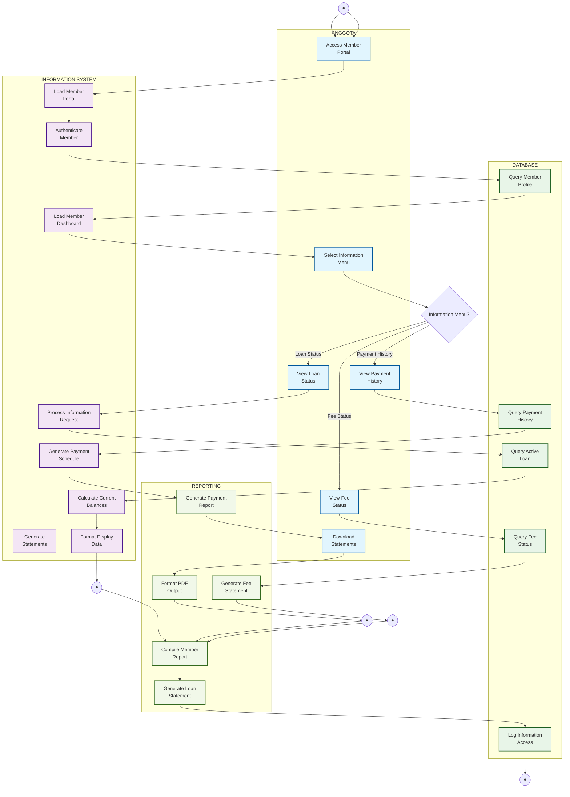

# Activity Diagram - Member Information & Status

## Penjelasan Member Information & Status

Diagram ini menunjukkan portal informasi lengkap untuk anggota melihat status dan history mereka:

### 👥 ANGGOTA (Member Lane)
- Access member portal dengan authentication
- View basic loan status (outstanding balance, monthly payment)
- Check payment history lengkap
- Monitor fee status (iuran)
- Download statements dalam format PDF

### 🤖 INFORMATION SYSTEM (System Lane)
- Authenticate member access
- Load personalized dashboard
- Process basic information requests
- Calculate current balances dan outstanding
- Generate basic payment schedules
- Format display data untuk user-friendly view

### 🗄️ DATABASE (Database Lane)
- Query basic member profile
- Access active loan information (limited)
- Retrieve payment history
- Check fee payment status
- Log information access untuk audit

### 📊 REPORTING (Reporting Lane)
- Generate basic loan statements
- Create payment reports
- Compile fee statements
- Compile basic member reports
- Format PDF outputs untuk download

### Fitur Utama
- **Basic Information**: Current loan status, balances, payments (limited)
- **Payment History**: Riwayat pembayaran member
- **Fee Monitoring**: Status iuran dan tunggakan
- **Download Capability**: PDF export untuk basic statements
- **Audit Trail**: Log access informasi
- **Mobile-Friendly**: Responsive design untuk mobile access
- **Privacy Protection**: Sensitive data (SHU, eligibility) hanya untuk admin

### Information Categories
- **Loan Status**: Basic outstanding balance, monthly payment (no eligibility info)
- **Payment History**: Payment records dengan basic breakdown
- **Fee Status**: Status iuran awal, bulanan, tunggakan
- **Restricted Information**: SHU, eligibility, detailed projections (admin only)
