# Activity Diagram - Master Periode & Stock Management (Admin)

```mermaid
flowchart TD
    %% Initial Node
    Start([●]) --> AccessAdminDashboard
    
    %% Admin Swimlane
    subgraph AdminLane [" KETUA ADMIN "]
        direction TB
        AccessAdminDashboard[Access Admin<br/>Dashboard]
        SetPeriodSettings[Set Period<br/>Settings]
        MonitorStockUsage[Monitor Stock<br/>Usage Real-time]
        ProcessManualPayment[Process Manual<br/>Payment]
        HandleSpecialCase[Handle Special<br/>Case]
        RecordCashFlow[Record Cash<br/>In/Out]
    end
    
    %% System Swimlane
    subgraph SystemLane [" ADMIN SYSTEM "]
        direction TB
        LoadAdminDashboard[Load Admin<br/>Dashboard]
        CheckPeriodStatus[Check Period<br/>Status]
        ValidateStockSettings[Validate Stock<br/>Settings]
        ProcessPeriodClosure[Process Period<br/>Closure]
        UpdateSystemStatus[Update System<br/>Status]
    end
    
    %% Database Swimlane
    subgraph DatabaseLane [" DATABASE "]
        direction TB
        QueryPeriodSettings[Query Period<br/>Settings]
        UpdateStockLimits[Update Stock<br/>Limits]
        LogAdminActivity[Log Admin<br/>Activity]
        QueryBalanceStatus[Query Balance<br/>Status]
        CreateJournalEntry[Create Journal<br/>Entry]
    end
    
    %% Flow connections - Main Menu
    Start --> AccessAdminDashboard
    AccessAdminDashboard --> LoadAdminDashboard
    LoadAdminDashboard --> SelectAdminMenu{Select Admin<br/>Menu?}
    
    %% Master Periode Flow
    SelectAdminMenu -->|Master Periode| AccessMasterPeriode[Access Master<br/>Periode]
    AccessMasterPeriode --> QueryPeriodSettings
    QueryPeriodSettings --> SetPeriodSettings
    
    SetPeriodSettings --> ConfigurePeriod[Configure Period<br/>Open/Close Dates]
    ConfigurePeriod --> SetAutoCloseRules[Set Auto-Close<br/>Rules]
    SetAutoCloseRules --> MonitorBalanceThreshold[Monitor Balance<br/>Threshold]
    MonitorBalanceThreshold --> QueryBalanceStatus
    
    QueryBalanceStatus --> BalanceDecision{Balance<br/>Sufficient?}
    BalanceDecision -->|No| AutoClosePeriod[Auto-Close Period<br/>Insufficient Balance]
    BalanceDecision -->|Yes| KeepPeriodOpen[Keep Period<br/>Open]
    
    AutoClosePeriod --> ProcessPeriodClosure
    ProcessPeriodClosure --> NotifyPeriodClosure[Notify Period<br/>Closure]
    NotifyPeriodClosure --> EndPeriode([●])
    
    %% Kelola Stok Paket Flow
    SelectAdminMenu -->|Kelola Stok Paket| AccessStockManagement[Access Stock<br/>Management]
    AccessStockManagement --> SetMonthlyStock[Set Monthly<br/>Stock Limit]
    SetMonthlyStock --> ValidateStockSettings
    ValidateStockSettings --> UpdateStockLimits
    
    UpdateStockLimits --> MonitorStockUsage
    MonitorStockUsage --> TrackReservations[Track Package<br/>Reservations]
    TrackReservations --> MonitorStockLevel{Stock Level<br/>Status?}
    
    MonitorStockLevel -->|Available| StockAvailable[Stock Available<br/>for Applications]
    MonitorStockLevel -->|Reserved| StockReserved[Stock Reserved<br/>Pending Approval]
    MonitorStockLevel -->|Used| StockUsed[Stock Used<br/>Final Approved]
    MonitorStockLevel -->|Depleted| StockDepleted[Stock Depleted<br/>Close Applications]
    
    StockDepleted --> CloseApplications[Close New<br/>Applications]
    CloseApplications --> NotifyStockDepletion[Notify Stock<br/>Depletion]
    
    %% Monthly Reset Flow
    StockAvailable --> ScheduleMonthlyReset[Schedule Monthly<br/>Reset]
    StockReserved --> ScheduleMonthlyReset
    StockUsed --> ScheduleMonthlyReset
    
    ScheduleMonthlyReset --> ProcessMonthlyReset[Process Monthly<br/>Reset]
    ProcessMonthlyReset --> ResetStockCounters[Reset Stock<br/>Counters]
    ResetStockCounters --> ReleaseExpiredReservations[Release Expired<br/>Reservations]
    ReleaseExpiredReservations --> EndStockManagement([●])
    
    %% Pembayaran Manual Flow
    SelectAdminMenu -->|Pembayaran Manual| AccessManualPayment[Access Manual<br/>Payment]
    AccessManualPayment --> VerifyPaymentProof[Verify Payment<br/>Proof]
    VerifyPaymentProof --> ProcessManualPayment
    ProcessManualPayment --> SetCustomInterest[Set Custom<br/>Interest Rate]
    SetCustomInterest --> ApproveManualPayment[Approve Manual<br/>Payment]
    ApproveManualPayment --> UpdateLoanStatus[Update Loan<br/>Status: PAID]
    UpdateLoanStatus --> CreateJournalEntry
    CreateJournalEntry --> NotifyPaymentProcessed[Notify Payment<br/>Processed]
    NotifyPaymentProcessed --> EndManualPayment([●])
    
    %% Case Khusus Flow
    SelectAdminMenu -->|Case Khusus| AccessSpecialCase[Access Special<br/>Case]
    AccessSpecialCase --> HandleSpecialCase
    HandleSpecialCase --> ConfigureCustomLoan[Configure Custom<br/>Loan Terms]
    ConfigureCustomLoan --> SetCustomAmount[Set Custom<br/>Amount]
    SetCustomAmount --> SetCustomTenor[Set Custom<br/>Tenor > 12 Months]
    SetCustomTenor --> SetCustomInterest2[Set Custom<br/>Interest Rate]
    SetCustomInterest2 --> ApproveSpecialCase[Approve Special<br/>Case]
    ApproveSpecialCase --> CreateSpecialApplication[Create Special<br/>Application]
    CreateSpecialApplication --> EndSpecialCase([●])
    
    %% Menu Dana Masuk/Keluar Flow
    SelectAdminMenu -->|Menu Dana| AccessCashFlowMenu[Access Cash Flow<br/>Menu]
    AccessCashFlowMenu --> CashFlowType{Cash Flow<br/>Type?}
    
    CashFlowType -->|Dana Masuk| RecordCashIn[Record Cash<br/>Inflow]
    CashFlowType -->|Dana Keluar| RecordCashOut[Record Cash<br/>Outflow]
    
    RecordCashIn --> InputCashInDetails[Input Cash In<br/>Details]
    InputCashInDetails --> CreateCashInJournal[Create Cash In<br/>Journal Entry]
    CreateCashInJournal --> JournalCashIn["DEBIT: Kas<br/>CREDIT: Source"]
    
    RecordCashOut --> InputCashOutDetails[Input Cash Out<br/>Details]
    InputCashOutDetails --> CreateCashOutJournal[Create Cash Out<br/>Journal Entry]
    CreateCashOutJournal --> JournalCashOut["DEBIT: Expense<br/>CREDIT: Kas"]
    
    JournalCashIn --> RecordCashFlow
    JournalCashOut --> RecordCashFlow
    RecordCashFlow --> LogAdminActivity
    LogAdminActivity --> EndCashFlow([●])
    
    %% Styling for swimlanes
    classDef adminStyle fill:#e3f2fd,stroke:#0d47a1,stroke-width:2px,color:#000
    classDef systemStyle fill:#f3e5f5,stroke:#4a148c,stroke-width:2px,color:#000
    classDef databaseStyle fill:#e8f5e8,stroke:#1b5e20,stroke-width:2px,color:#000
    classDef decisionStyle fill:#fff3e0,stroke:#ef6c00,stroke-width:2px,color:#000
    
    class AccessAdminDashboard,SetPeriodSettings,MonitorStockUsage,ProcessManualPayment,HandleSpecialCase,RecordCashFlow adminStyle
    class LoadAdminDashboard,CheckPeriodStatus,ValidateStockSettings,ProcessPeriodClosure,UpdateSystemStatus systemStyle
    class QueryPeriodSettings,UpdateStockLimits,LogAdminActivity,QueryBalanceStatus,CreateJournalEntry databaseStyle
```

## Penjelasan Master Periode & Stock Management

Diagram ini menunjukkan fitur-fitur administrasi khusus untuk Ketua Admin:

### 👤 KETUA ADMIN (Admin Lane)
- Set periode buka/tutup aplikasi pinjaman
- Kelola stok paket bulanan dengan real-time monitoring
- Process pembayaran manual dengan verifikasi
- Handle case khusus dengan custom terms
- Record cash flow masuk dan keluar
- Monitor balance threshold untuk auto-close

### 🤖 ADMIN SYSTEM (System Lane)
- Load admin dashboard dengan metrics
- Check periode status dan balance
- Validate stock settings dan limits
- Process automatic period closure
- Update system status real-time
- Generate notifications dan alerts

### 🗄️ DATABASE (Database Lane)
- Store periode settings dan rules
- Update stock limits dan counters
- Log semua admin activities
- Query balance status untuk monitoring
- Create journal entries untuk cash flow
- Track stock reservations dan usage

### Fitur Utama

#### 1. **Master Periode**
- Set tanggal buka/tutup periode aplikasi
- Auto-close rules berdasarkan:
  - Akhir bulan (countdown otomatis)
  - Balance threshold tidak mencukupi
  - Stok paket habis
- Monitor real-time status periode

#### 2. **Kelola Stok Paket**
- Set limit stok paket per bulan
- Real-time tracking: Available/Reserved/Used/Depleted
- Monthly reset otomatis setiap awal bulan
- Release expired reservations
- Auto-close aplikasi saat stok habis

#### 3. **Pembayaran Manual**
- Verify bukti pembayaran pelunasan
- Set custom interest rate untuk pelunasan
- Approve pembayaran manual
- Update loan status langsung ke PAID
- Journal entry otomatis

#### 4. **Case Khusus**
- Custom loan amount (input manual, tidak terbatas paket)
- Custom tenor > 12 bulan
- Custom interest rate
- Bypass normal approval workflow

#### 5. **Menu Dana Masuk/Keluar**
- Record cash inflow dari berbagai sumber
- Record cash outflow untuk berbagai pengeluaran
- Automatic journal entry creation
- Complete audit trail

### Stock Status Flow
1. **Available** → Tersedia untuk aplikasi baru
2. **Reserved** → Direservasi untuk pending approval
3. **Used** → Terpakai setelah final approval
4. **Depleted** → Habis, tutup aplikasi baru

### Automation Features
- **Auto Period Closure**: Based on balance/date
- **Monthly Stock Reset**: Reset counters awal bulan
- **Expired Reservation Release**: Auto-release reservasi expired
- **Real-time Monitoring**: Live updates stock dan period status
