# Diagram Aktivitas - Registrasi Anggota Baru

```mermaid
flowchart TD
    %% Initial Node
    Start([●]) --> LoginFirstTime
    
    %% New Member Swimlane
    subgraph NewMemberLane [" ANGGOTA BARU "]
        direction TB
        LoginFirstTime[Login Pertama Kali<br/>sebagai Anggota Baru]
        FillRegistrationForm[Isi Form<br/>Registrasi]
        UploadDocuments[Upload Dokumen<br/>yang Diperlukan]
        PayInitialFee[Bayar Iuran Awal<br/>Rp 50.000]
        ViewPendingStatus[Lihat Status<br/>Pending]
        WaitActivationPeriod[Tunggu Periode<br/>Aktivasi 1 Bulan]
    end
    
    %% System Swimlane
    subgraph SystemLane [" SISTEM REGISTRASI "]
        direction TB
        CheckMemberStatus[Cek Status<br/>Anggota]
        ValidateRegistration[Validasi Data<br/>Registrasi]
        SetStatusPending[Atur Status:<br/>ANGGOTA_BARU_PENDING]
        ScheduleActivation[Jadwalkan Aktivasi<br/>Setelah 1 Bulan]
        ProcessActivation[Process Member<br/>Activation]
        SetStatusActive[Set Status:<br/>ACTIVE_MEMBER]
    end
    
    %% Database Swimlane
    subgraph DatabaseLane [" DATABASE "]
        direction TB
        CreateMemberRecord[Create Member<br/>Record]
        StoreMemberDocuments[Store Member<br/>Documents]
        UpdateMemberStatus[Update Member<br/>Status]
        LogRegistrationActivity[Log Registration<br/>Activity]
    end
    
    %% Admin Swimlane
    subgraph AdminLane [" ADMIN "]
        direction TB
        ReviewRegistration[Review Registration<br/>Application]
        ValidateDocuments[Validate Uploaded<br/>Documents]
        ApproveRegistration[Approve Registration<br/>Application]
    end
    
    %% Flow connections - Registration Process
    Start --> LoginFirstTime
    LoginFirstTime --> CheckMemberStatus
    CheckMemberStatus --> NewMemberDecision{New Member<br/>Status?}
    
    NewMemberDecision -->|Existing Active| RedirectActiveDashboard[Redirect to Active<br/>Member Dashboard]
    NewMemberDecision -->|New Member| ShowRegistrationForm[Show Registration<br/>Form]
    
    RedirectActiveDashboard --> EndExisting([●])
    
    ShowRegistrationForm --> FillRegistrationForm
    FillRegistrationForm --> InputPersonalData[Input Personal<br/>Data]
    InputPersonalData --> InputEmployeeData[Input Employee<br/>Data & Position]
    InputEmployeeData --> UploadDocuments
    
    UploadDocuments --> UploadKTP[Upload KTP<br/>Copy]
    UploadKTP --> UploadPhoto[Upload Foto<br/>3x4]
    UploadPhoto --> UploadOtherDocs[Upload Other Required<br/>Documents]
    
    UploadOtherDocs --> ValidateRegistration
    ValidateRegistration --> ValidationResult{Validation<br/>Result?}
    
    ValidationResult -->|Invalid| ShowValidationError[Show Validation<br/>Error Message]
    ShowValidationError --> FillRegistrationForm
    
    ValidationResult -->|Valid| CreateMemberRecord
    CreateMemberRecord --> StoreMemberDocuments
    StoreMemberDocuments --> SetStatusPending
    
    SetStatusPending --> PayInitialFee
    PayInitialFee --> PaymentMethod{Payment<br/>Method?}
    
    PaymentMethod -->|Bank Transfer| ProcessBankTransfer[Process Bank<br/>Transfer]
    PaymentMethod -->|Cash Payment| ProcessCashPayment[Process Cash<br/>Payment at Office]
    PaymentMethod -->|Mobile Banking| ProcessMobileBanking[Process Mobile<br/>Banking Payment]
    
    ProcessBankTransfer --> ConfirmPayment[Confirm Initial<br/>Fee Payment]
    ProcessCashPayment --> ConfirmPayment
    ProcessMobileBanking --> ConfirmPayment
    
    ConfirmPayment --> JournalInitialFee["JOURNAL INITIAL FEE<br/>DEBIT: Kas Rp 50.000<br/>CREDIT: Simpanan Anggota Rp 50.000"]
    JournalInitialFee --> UpdatePaymentStatus[Update Payment<br/>Status]
    
    UpdatePaymentStatus --> ScheduleActivation
    ScheduleActivation --> NotifyPendingStatus[Notify Pending<br/>Status]
    NotifyPendingStatus --> ViewPendingStatus
    
    %% Admin Review Process
    ViewPendingStatus --> TriggerAdminReview[Trigger Admin<br/>Review]
    TriggerAdminReview --> ReviewRegistration
    ReviewRegistration --> ValidateDocuments
    ValidateDocuments --> AdminDecision{Admin<br/>Decision?}
    
    AdminDecision -->|Approve| ApproveRegistration
    AdminDecision -->|Reject| RejectRegistration[Reject Registration<br/>with Reason]
    
    RejectRegistration --> NotifyRejection[Notify Registration<br/>Rejection]
    NotifyRejection --> RefundInitialFee[Refund Initial<br/>Fee]
    RefundInitialFee --> EndRejected([●])
    
    ApproveRegistration --> WaitActivationPeriod
    WaitActivationPeriod --> CheckActivationDate{1 Month<br/>Completed?}
    
    CheckActivationDate -->|No| ContinueWaiting[Continue Waiting<br/>Period]
    ContinueWaiting --> WaitActivationPeriod
    
    CheckActivationDate -->|Yes| ProcessActivation
    ProcessActivation --> SetStatusActive
    SetStatusActive --> UpdateMemberStatus
    UpdateMemberStatus --> GrantLoanAccess[Grant Loan<br/>Application Access]
    
    GrantLoanAccess --> NotifyActivation[Notify Member<br/>Activation]
    NotifyActivation --> LogRegistrationActivity
    LogRegistrationActivity --> RedirectActiveDashboard2[Redirect to Active<br/>Member Dashboard]
    RedirectActiveDashboard2 --> EndActivated([●])
    
    %% Pending Dashboard Features
    ViewPendingStatus --> AccessPendingDashboard[Access Pending<br/>Dashboard]
    AccessPendingDashboard --> PendingMenuDecision{Pending Menu<br/>Selection?}
    
    PendingMenuDecision -->|View Status| ViewRegistrationStatus[View Registration<br/>Status]
    PendingMenuDecision -->|Pay Monthly Fee| PayMonthlyFeePending[Pay Monthly Fee<br/>During Pending Period]
    PendingMenuDecision -->|View Info| ViewCooperativeInfo[View Cooperative<br/>Information]
    
    ViewRegistrationStatus --> ShowCountdown[Show Activation<br/>Countdown]
    PayMonthlyFeePending --> ProcessMonthlyFee[Process Monthly<br/>Fee Rp 25.000]
    ViewCooperativeInfo --> ShowCooperativeInfo[Show Cooperative<br/>Rules & Benefits]
    
    ShowCountdown --> EndPendingMenu([●])
    ProcessMonthlyFee --> EndPendingMenu
    ShowCooperativeInfo --> EndPendingMenu
    
    %% Styling for swimlanes
    classDef memberStyle fill:#e1f5fe,stroke:#01579b,stroke-width:2px,color:#000
    classDef systemStyle fill:#f3e5f5,stroke:#4a148c,stroke-width:2px,color:#000
    classDef databaseStyle fill:#e8f5e8,stroke:#1b5e20,stroke-width:2px,color:#000
    classDef adminStyle fill:#e3f2fd,stroke:#0d47a1,stroke-width:2px,color:#000
    classDef decisionStyle fill:#fff3e0,stroke:#ef6c00,stroke-width:2px,color:#000
    
    class LoginFirstTime,FillRegistrationForm,UploadDocuments,PayInitialFee,ViewPendingStatus,WaitActivationPeriod memberStyle
    class CheckMemberStatus,ValidateRegistration,SetStatusPending,ScheduleActivation,ProcessActivation,SetStatusActive systemStyle
    class CreateMemberRecord,StoreMemberDocuments,UpdateMemberStatus,LogRegistrationActivity databaseStyle
    class ReviewRegistration,ValidateDocuments,ApproveRegistration adminStyle
```

## Penjelasan New Member Registration

Diagram ini menunjukkan proses registrasi anggota baru dengan sistem pending selama 1 bulan:

### 👥 ANGGOTA BARU (New Member Lane)
- Login pertama kali sebagai anggota baru
- Fill form registrasi lengkap dengan data pribadi dan karyawan
- Upload dokumen yang diperlukan (KTP, foto, dll)
- Bayar iuran awal Rp 50.000
- Wait masa aktivasi 1 bulan
- Access limited dashboard selama pending

### 🤖 REGISTRATION SYSTEM (System Lane)
- Check status member saat login
- Validate data registrasi
- Set status NEW_MEMBER_PENDING
- Schedule aktivasi otomatis setelah 1 bulan
- Process aktivasi ke ACTIVE_MEMBER
- Grant akses penuh setelah aktivasi

### 🗄️ DATABASE (Database Lane)
- Create member record baru
- Store dokumen registrasi
- Update status member sesuai tahapan
- Log semua aktivitas registrasi
- Track payment initial fee

### 👤 ADMIN (Admin Lane)
- Review aplikasi registrasi
- Validate dokumen yang diupload
- Approve/reject registrasi
- Monitor new member applications

### Status Flow Anggota Baru

#### 1. **NEW_MEMBER** (Status Awal)
- Baru login pertama kali
- Belum mengisi form registrasi
- Tidak ada akses dashboard

#### 2. **NEW_MEMBER_PENDING** (Setelah Registrasi)
- Sudah mengisi form dan bayar iuran awal
- Menunggu 1 bulan masa aktivasi
- Dashboard terbatas: View status, bayar iuran bulanan, info koperasi
- **TIDAK BISA**: Mengajukan pinjaman

#### 3. **ACTIVE_MEMBER** (Setelah 1 Bulan)
- Aktivasi otomatis setelah 1 bulan
- Akses penuh dashboard anggota
- **BISA**: Mengajukan pinjaman, semua fitur

### Fitur Pending Dashboard
Selama masa pending (1 bulan), anggota baru hanya bisa:
- **View Registration Status**: Lihat countdown aktivasi
- **Pay Monthly Fee**: Bayar iuran bulanan Rp 25.000
- **View Cooperative Info**: Info tentang koperasi, aturan, manfaat

### Payment Options
- **Bank Transfer**: Transfer ke rekening koperasi
- **Cash Payment**: Bayar tunai di kantor
- **Mobile Banking**: Pembayaran via mobile banking
- **Salary Deduction**: Potong gaji (untuk karyawan)

### Required Documents
- **KTP**: Foto copy Kartu Tanda Penduduk
- **Foto 3x4**: Foto formal untuk database
- **Employee Data**: Data karyawan dan posisi kerja
- **Other Documents**: Dokumen pendukung lainnya

### Automation Features
- **Auto Activation**: Aktivasi otomatis setelah 1 bulan
- **Status Tracking**: Real-time tracking status registrasi
- **Payment Integration**: Integrasi dengan berbagai metode pembayaran
- **Document Storage**: Penyimpanan dokumen digital yang aman
