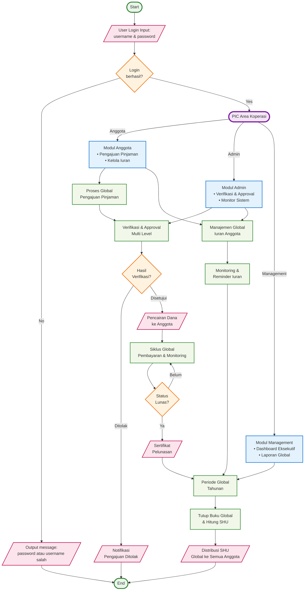

# Flowchart Global Sistem Koperasi

## Keterangan Flowchart Global Sistem Koperasi

### Konsep Global System:

#### 1. **PIC Area Koperasi (Central Hub)**
- Titik pusat distribusi akses berdasarkan role user
- Mengatur alur kerja global seluruh sistem

#### 2. **3 Modul Utama (High-Level)**
- **Modul Anggota**: Pengajuan pinjaman & kelola iuran
- **Modul Admin**: Verifikasi, approval, & monitoring sistem
- **Modul Management**: Dashboard eksekutif & laporan global

#### 3. **Proses Global Terintegrasi**
- **Proses Pinjaman**: Dari pengajuan hingga pencairan (global process)
- **Verifikasi Multi-Level**: Sistem approval terintegrasi
- **Siklus Pembayaran**: Monitoring global semua anggota
- **Manajemen Iuran**: Sistem iuran global seluruh anggota

#### 4. **Periode Global Tahunan**
- Tutup buku sistem secara global
- Distribusi SHU untuk seluruh anggota
- Reset sistem untuk periode baru

### Karakteristik Global:
- **Terintegrasi**: Semua proses saling terhubung
- **Terpusat**: PIC Area sebagai koordinator utama
- **Modular**: 3 modul utama yang fokus pada fungsi masing-masing
- **Scalable**: Dapat menangani banyak anggota secara bersamaan
- **Comprehensive**: Mencakup seluruh siklus hidup koperasi

### Alur Kerja Global:
1. **Login** → **PIC Area** → **Role-based Module**
2. **Global Process** → **Multi-Level Verification**
3. **Global Monitoring** → **Periodic Global Closure**
4. **Global Distribution** → **System Reset**

Flowchart ini memberikan pandangan global (high-level) dari sistem koperasi yang kompleks, mirip dengan struktur pada gambar referensi yang Anda berikan.
